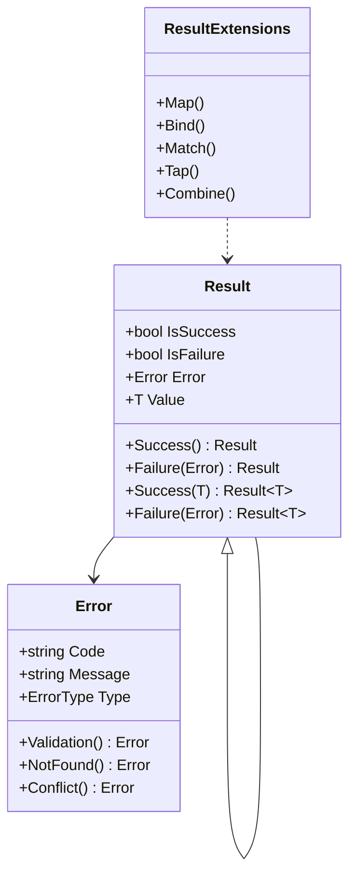
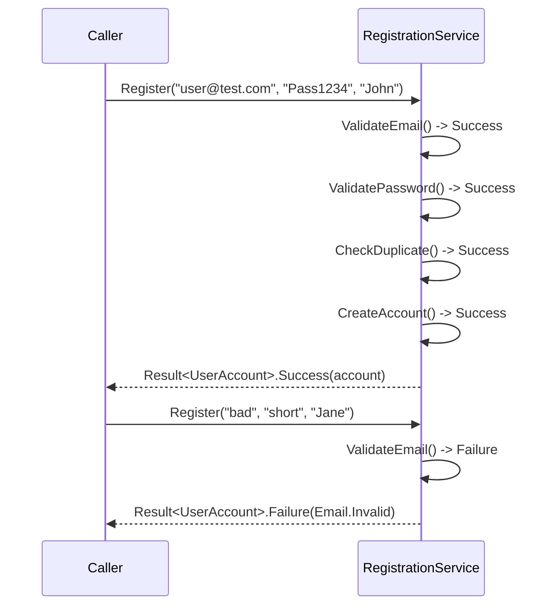

# Result Pattern

## Memory Hook (one-liner)
"A return type that says 'here is the answer OR here is why it failed' — no exceptions needed for expected failures."

## Problem
Using exceptions for expected business failures (validation errors, not found, duplicates) is expensive, hard to compose, and mixes control flow with error handling. Returning null or magic values loses error context.

## Naive Approach
```csharp
// Exceptions for flow control — expensive and unclear
public User Register(string email, string password)
{
    if (!IsValidEmail(email))
        throw new ValidationException("Invalid email");  // caller must catch
    if (EmailExists(email))
        throw new ConflictException("Email taken");       // different exception type
    return CreateUser(email, password);
}
```

## Pattern Solution
Return `Result<T>` that carries either a value (success) or a structured `Error` (failure). Compose operations with `Map`, `Bind`, and `Match` — no try/catch needed for business-level failures.

```csharp
public Result<UserAccount> Register(string email, string password) =>
    ValidateEmail(email)
        .Bind(_ => ValidatePassword(password))
        .Bind(_ => CheckDuplicate(email))
        .Bind(_ => CreateAccount(email, password));
```

## When To Use
- Business operations that have expected, well-known failure modes
- API endpoints where you need structured error responses
- Composing validation chains without nested if-else
- Domain services where exceptions should be reserved for unexpected failures
- Functional-style pipelines with Map/Bind/Match

## When NOT To Use
- Truly exceptional conditions (out of memory, network down) — use exceptions
- Simple CRUD with no business validation
- Team is unfamiliar with functional concepts and prefers try/catch
- Performance overhead of Result objects matters (rare)
- Framework already provides a result pattern (e.g., FluentValidation + MediatR)

## Participants
| Role | Class | Purpose |
|------|-------|---------|
| Result | `Result`, `Result<T>` | Wraps success/failure |
| Error | `Error` | Structured error with code, message, type |
| Extensions | `ResultExtensions` | Map, Bind, Match, Tap, Combine |
| Example | `UserRegistrationService` | Realistic usage demonstration |

## Variants
- **Railway-oriented programming** — two-track model (success/failure)
- **OneOf / Discriminated union** — `OneOf<Success, NotFound, ValidationError>`
- **FluentResults** — popular library with similar API
- **ErrorOr** — lightweight alternative by Amichai Mantinband

## Tradeoffs Table
| Advantage | Disadvantage |
|-----------|-------------|
| No exceptions for expected failures | New abstraction to learn |
| Composable with Map/Bind/Match | Result objects allocate on heap |
| Structured errors with codes | Can be verbose without extension methods |
| Self-documenting method signatures | Team must adopt consistently |

## Common Interview Questions
1. **When should you use Result vs exceptions?** Result for expected business failures; exceptions for unexpected infrastructure failures.
2. **What is Bind/FlatMap?** Chains two result-producing operations — if the first fails, the second is skipped.
3. **How does Result pattern relate to monads?** `Result<T>` is the Either monad from functional programming (Right = success, Left = error).

## Comparison with Similar Patterns
| Pattern | Difference |
|---------|-----------|
| **Exceptions** | Exceptions unwind the stack; Result returns normally |
| **Null Object** | Null Object provides default behavior; Result provides error info |
| **Option/Maybe** | Option handles absence; Result handles absence with a reason |

## Mermaid Diagrams

### Class Diagram


### Sequence Diagram


## Similar Patterns to Review Next
- Value Object (both enforce domain invariants)
- Specification (composable business rules)
- CQRS (command handlers often return Result)
