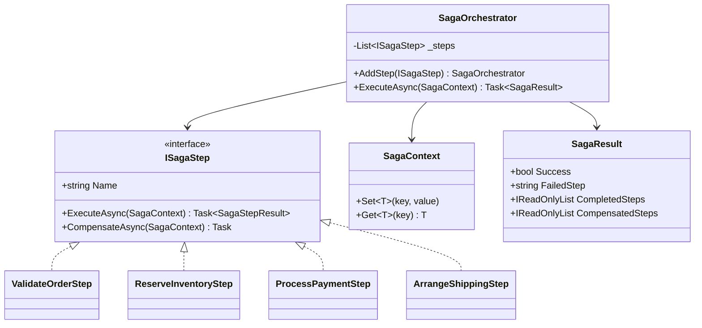
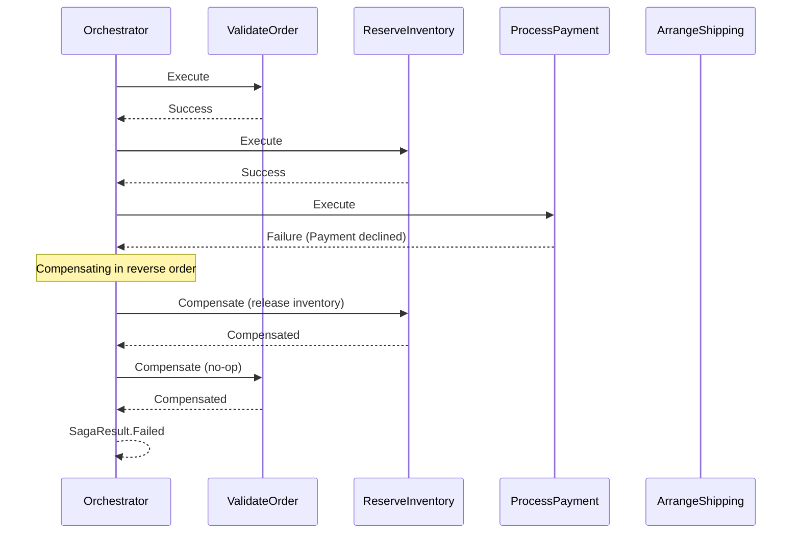

# Saga Pattern

## Memory Hook (one-liner)
"A chain of steps with an undo button for each — if step 3 fails, automatically undo steps 2 and 1."

## Problem
A business process spans multiple services or aggregates (validate, reserve inventory, charge payment, arrange shipping). Unlike a local database transaction, you cannot wrap distributed operations in a single ACID transaction. If payment fails after inventory is reserved, you need to release the inventory.

## Naive Approach
```csharp
try
{
    ValidateOrder(order);
    ReserveInventory(order);
    ChargePayment(order);
    ArrangeShipping(order);  // fails!
}
catch
{
    // How do we know which steps succeeded? Manual cleanup is fragile.
    TryRefundPayment(order);
    TryReleaseInventory(order);
}
```

## Pattern Solution
Define each step as an `ISagaStep` with `Execute` and `Compensate` methods. The `SagaOrchestrator` runs steps in order. If any step fails, it compensates all previously completed steps in reverse order.

## When To Use
- Multi-step business processes that span multiple aggregates or services
- Long-running transactions where holding database locks is impractical
- Each step has a clear compensation (undo) action
- You need visibility into which steps completed and which were compensated
- Microservice choreography or orchestration patterns

## When NOT To Use
- All operations can run in a single database transaction
- Steps cannot be compensated (e.g., sending an email cannot be "unsent")
- The process is simple enough for a try/catch with manual cleanup
- Strong consistency (ACID) is required — Saga provides eventual consistency
- The number of steps is very small (1-2) and compensation is trivial

## Participants
| Role | Class | Purpose |
|------|-------|---------|
| Step Interface | `ISagaStep` | Execute + Compensate contract |
| Context | `SagaContext` | Shared mutable state between steps |
| Orchestrator | `SagaOrchestrator` | Runs steps and compensates on failure |
| Result | `SagaResult` | Outcome with completed/compensated steps |
| Steps | `ValidateOrderStep`, `ReserveInventoryStep`, `ProcessPaymentStep`, `ArrangeShippingStep` | Concrete steps |

## Variants
- **Orchestration** — a central coordinator drives the steps (shown here)
- **Choreography** — each step publishes an event; the next step reacts
- **Process Manager** — stateful orchestrator that persists saga state
- **Compensating Transaction** — broader term for the undo mechanism

## Tradeoffs Table
| Advantage | Disadvantage |
|-----------|-------------|
| Handles distributed transactions without 2PC | Eventually consistent, not ACID |
| Clear compensation logic | Every step needs a compensate method |
| Visible execution trail | Compensation can also fail (needs its own error handling) |
| Each step is independently testable | Orchestrator adds complexity |

## Common Interview Questions
1. **Saga vs two-phase commit (2PC)?** 2PC locks resources across services (doesn't scale); Saga uses compensation (scales, but eventually consistent).
2. **What if compensation fails?** Log it, retry, or escalate to manual intervention. Some systems use a "dead letter" queue.
3. **Orchestration vs Choreography?** Orchestration has a central coordinator (easier to reason about); Choreography is fully decentralized (more resilient but harder to trace).

## Comparison with Similar Patterns
| Pattern | Difference |
|---------|-----------|
| **Unit of Work** | UoW is local (single DB); Saga is distributed |
| **Chain of Responsibility** | CoR passes a request; Saga runs steps with compensation |
| **Command** | Saga steps are commands with an undo (compensate) action |

## Mermaid Diagrams

### Class Diagram


### Sequence Diagram (Failure Scenario)


## Similar Patterns to Review Next
- Unit of Work (local transactions)
- Domain Events (step communication)
- Outbox (reliable event publishing between steps)
