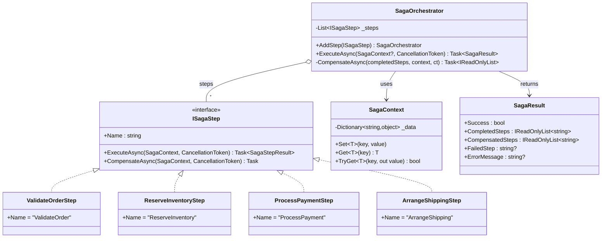
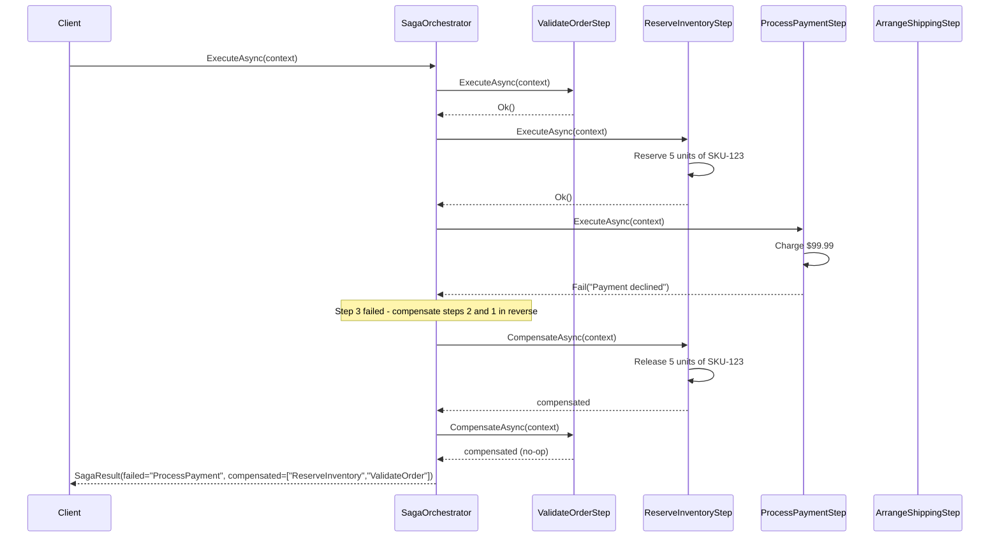

# Saga Pattern (Orchestrator)

## Memory Hook
"If step 3 fails, undo steps 2 and 1" -- coordinate a multi-step distributed transaction with compensating actions for each step.

## Problem
An order fulfillment process spans multiple services: validate the order, reserve inventory, process payment, and arrange shipping. Each step calls a different service or database. If payment processing fails after inventory has been reserved, the reservation must be released. Traditional database transactions (ACID) cannot span multiple services. Without a coordination mechanism, the system can be left in an inconsistent state where inventory is reserved but payment never went through.

## Naive Approach
A single `FulfillOrder` method calls each service sequentially and wraps everything in nested try/catch blocks: `try { validate(); try { reserve(); try { pay(); try { ship(); } catch { refund(); } } catch { release(); } } catch { ... } }`. This spaghetti of nested compensation logic is fragile, hard to test, and impossible to extend. Adding a new step requires restructuring the entire nesting. Error handling for compensation failures is ad-hoc or missing.

## Pattern Solution
Define each step as an `ISagaStep` with `ExecuteAsync` and `CompensateAsync` methods. A `SagaOrchestrator` runs steps in sequence. If step N fails, it automatically calls `CompensateAsync` on steps N-1 through 0 in reverse order. Steps communicate through a shared `SagaContext` dictionary. The orchestrator returns a `SagaResult` indicating success or failure, including which steps completed, which failed, and which were compensated. Adding a new step means creating a new class and calling `AddStep()`.

## When To Use
- A business process spans multiple services or databases that cannot share a single ACID transaction.
- Each step has a well-defined compensating action (undo/rollback).
- You need visibility into which steps succeeded and which were compensated.
- The process is sequential and step order matters.
- Eventual consistency is acceptable (the system may be temporarily inconsistent during compensation).

## When NOT To Use
- All operations can be performed within a single database transaction (use a regular transaction).
- Compensating actions are not possible or meaningful for some steps.
- The process requires strict isolation (other transactions must not see intermediate states).
- Steps can run in parallel and do not depend on each other (use a parallel workflow engine).
- The number of steps is very small (1-2) and a simple try/catch is clearer.

## Key Participants

| Participant | Role |
|---|---|
| `ISagaStep` (Step Interface) | Declares `Name`, `ExecuteAsync`, and `CompensateAsync`. |
| `SagaOrchestrator` | Runs steps in order; compensates in reverse on failure. |
| `SagaContext` | Shared mutable dictionary for passing data between steps. |
| `SagaResult` | Outcome DTO: success/failure, completed steps, compensated steps, failed step, error message. |
| `SagaStepResult` | Per-step outcome: success or failure with error message. |
| `ValidateOrderStep` | Step 1: validates order details. Compensation: no-op (validation is side-effect-free). |
| `ReserveInventoryStep` | Step 2: reserves stock. Compensation: releases the reservation. |
| `ProcessPaymentStep` | Step 3: charges the customer. Compensation: issues a refund. |
| `ArrangeShippingStep` | Step 4: books a shipment. Compensation: cancels the shipping arrangement. |

## Variants
- **Orchestration (this repo):** A central orchestrator controls the flow and compensation. Simple, easy to debug, but creates a single point of coordination.
- **Choreography:** Each service publishes events and listens for events from others. No central coordinator, but harder to understand and debug the overall flow.
- **Parallel Saga:** Some steps can run in parallel (e.g., reserve inventory and pre-authorize payment simultaneously). Requires a more sophisticated orchestrator.
- **Saga with Timeout:** Steps have deadlines; if a step does not complete in time, it is treated as a failure and compensation begins.
- **Persistent Saga:** The saga state is stored in a database so it can survive process restarts. Essential for long-running sagas.

## Tradeoffs

| Advantage | Disadvantage |
|---|---|
| Manages distributed transactions without 2PC or XA. | Eventually consistent: intermediate states are visible to other operations. |
| Each step's compensation logic is explicit and testable. | Compensation logic can be complex and may itself fail. |
| Adding new steps is modular (one class per step). | The orchestrator is a single point of failure (unless made persistent). |
| Full visibility into saga execution (completed, failed, compensated steps). | Does not provide isolation: concurrent sagas may conflict. |
| Works across heterogeneous systems (different databases, services, brokers). | Requires idempotent steps and compensations for reliability. |

## Common Interview Questions
1. What is the difference between the Saga pattern and two-phase commit (2PC), and when would you use each?
2. How do you handle a situation where a compensation step itself fails?
3. What is the difference between orchestration-based and choreography-based sagas?

## Comparison with Similar Patterns

| Aspect | Saga (Orchestrator) | Two-Phase Commit (2PC) |
|---|---|---|
| Consistency | Eventual consistency (compensating actions restore consistency). | Strong consistency (all-or-nothing atomic commit). |
| Isolation | No isolation: intermediate states are visible. | Full isolation until commit. |
| Coordinator | Application-level orchestrator. | Database/transaction manager. |
| Performance | Better: no locks held across services. | Worse: locks held during prepare/commit phases. |
| Failure handling | Compensating actions undo completed steps. | Abort rolls back all participants atomically. |
| Scalability | Scales well across distributed services. | Does not scale well across heterogeneous systems. |
| Complexity | Compensation logic must be explicitly written. | Handled by the transaction manager. |

## Mermaid Class Diagram

## Mermaid Sequence Diagram

## Similar Patterns to Review Next
- **Outbox Pattern** -- ensures saga events are reliably published even if the broker is down.
- **Command** -- each saga step can be modeled as a command with an undo counterpart.
- **State Machine** -- model the saga as a state machine for complex workflows with branches and loops.
- **Compensating Transaction** -- the fundamental building block of saga compensation.
