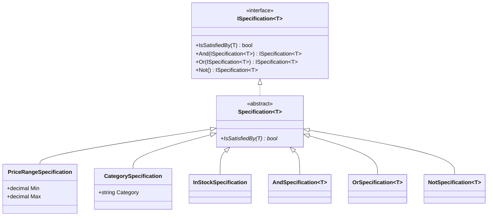
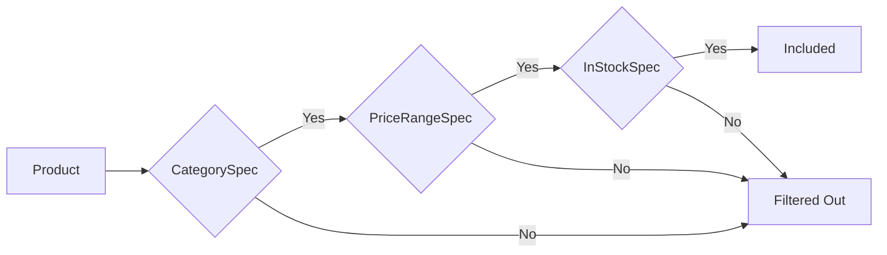

# Specification Pattern

## Memory Hook (one-liner)
"A reusable, composable business rule object — snap rules together like Lego bricks with And, Or, and Not."

## Problem
Query filtering logic gets duplicated across repositories, services, and controllers. Complex filters become long chains of `&&` and `||` that are hard to test, name, and reuse.

## Naive Approach
```csharp
// Filtering logic duplicated and tangled everywhere
var results = products
    .Where(p => p.Price >= 10 && p.Price <= 50
        && p.Category == "Electronics"
        && p.StockQuantity > 0
        && p.Name.Contains(searchTerm));
```
If the "affordable electronics" rule changes, every call site must be updated.

## Pattern Solution
Encapsulate each rule in a named class that implements `IsSatisfiedBy(T)`. Compose rules with `And`, `Or`, and `Not` operators. Each specification is independently testable and reusable.

```csharp
var spec = new CategorySpecification("Electronics")
    .And(new PriceRangeSpecification(10m, 50m))
    .And(new InStockSpecification());
```

## When To Use
- Business rules that need names for readability and documentation
- Filters reused across multiple queries or services
- Complex search pages with dynamic filter combinations
- You want to unit test each business rule independently
- Domain experts need to read and validate filtering logic

## When NOT To Use
- Simple, one-off queries that will never be reused
- Specifications add overhead when LINQ-to-SQL translation is needed
- Performance-critical queries where expression trees matter more
- The rules are so simple that named methods suffice
- Framework already provides a powerful query builder (e.g., OData)

## Participants
| Role | Class | Purpose |
|------|-------|---------|
| Interface | `ISpecification<T>` | Contract: `IsSatisfiedBy` + composition |
| Base Class | `Specification<T>` | Provides And/Or/Not composition |
| Concrete Specs | `PriceRangeSpecification`, etc. | Named business rules |
| Composites | `AndSpecification`, `OrSpecification`, `NotSpecification` | Combine specs |

## Variants
- **Expression-based** — `ISpecification<T>` returns `Expression<Func<T, bool>>` for EF Core translation
- **Composite** — And/Or/Not via composition (shown here)
- **Policy Specification** — used in authorization (CanUserAccess)
- **Query Object** — includes sorting and paging alongside filtering

## Tradeoffs Table
| Advantage | Disadvantage |
|-----------|-------------|
| Named, reusable business rules | More classes than inline LINQ |
| Composable with And/Or/Not | In-memory evaluation only (unless expression-based) |
| Each rule independently testable | Can become over-engineered for simple filters |
| Self-documenting filter trees | Debugging composite specs requires tracing the tree |

## Common Interview Questions
1. **How do you use Specification with EF Core?** Return `Expression<Func<T, bool>>` instead of `Func<T, bool>` so the query translates to SQL.
2. **What's the difference between Specification and Strategy?** Specification returns bool (a rule); Strategy encapsulates an algorithm (a behavior).
3. **Can specifications replace repository query methods?** Yes — `repo.FindAsync(spec)` replaces many specialized methods.

## Comparison with Similar Patterns
| Pattern | Difference |
|---------|-----------|
| **Strategy** | Strategy encapsulates algorithms; Specification encapsulates rules |
| **Chain of Responsibility** | CoR passes a request along a chain; Specification evaluates a candidate |
| **Composite** | Specification uses Composite pattern internally for And/Or/Not |

## Mermaid Diagrams

### Class Diagram


### Flow Diagram


## Similar Patterns to Review Next
- Repository (uses Specification for queries)
- Strategy
- Composite
