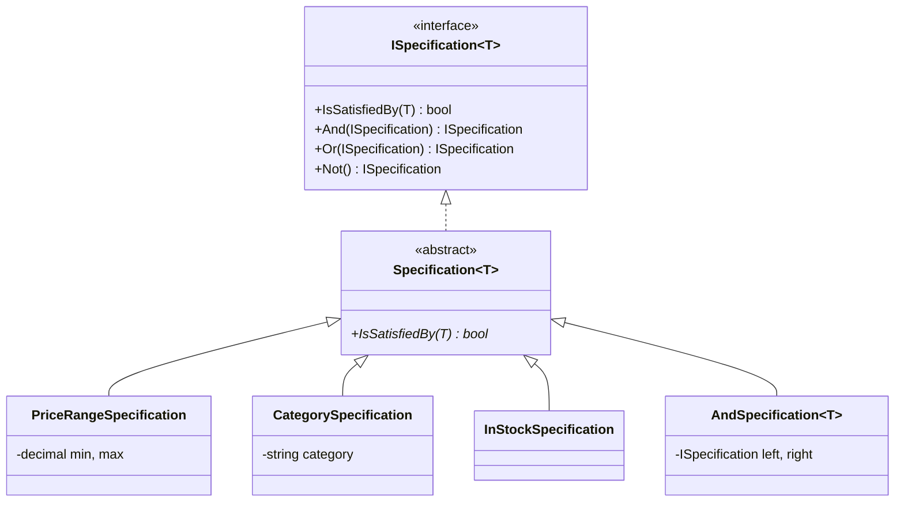
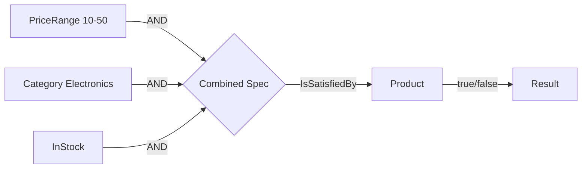

# Specification Pattern

## Memory Hook (one-liner)
"A business rule turned into an object — combine rules with And/Or/Not like building blocks."

## Problem
Filter logic duplicated across repositories, services, and controllers. Complex multi-criteria searches become tangled conditionals that are impossible to test individually.

## Naive Approach
```csharp
// Filtering logic duplicated and tangled
var products = allProducts
    .Where(p => p.Price >= minPrice && p.Price <= maxPrice)
    .Where(p => p.Category == category || category == null)
    .Where(p => p.StockQuantity > 0 || includeOutOfStock)
    .Where(p => p.Name.Contains(search) || p.Category.Contains(search));
```
Each query method re-implements similar logic with slight variations. Adding a new filter means editing multiple methods.

## Pattern Solution
Encapsulate each filter as a Specification object. Compose complex filters by combining simple specifications with `And()`, `Or()`, and `Not()`. Each specification is independently testable.

## When To Use
- Multi-criteria search or filter pages
- Business rules that appear in multiple contexts (validation + querying)
- You want to test individual filter rules in isolation
- Rules need to be combined dynamically at runtime
- Domain-Driven Design where business rules belong in the domain layer

## When NOT To Use
- Simple single-field filters where LINQ is sufficient
- Performance-critical database queries (specifications may not translate to SQL)
- Rules that never compose or vary
- When the ORM already provides powerful query builders
- Trivial CRUD applications

## Participants
| Role | Class | Purpose |
|------|-------|---------|
| Interface | `ISpecification<T>` | Contract for evaluating and composing rules |
| Base Class | `Specification<T>` | Abstract base with And/Or/Not operators |
| Concrete Specs | `PriceRangeSpecification`, etc. | Individual business rules |
| Composites | `AndSpecification`, `OrSpecification`, `NotSpecification` | Combine rules |

## Variants
- **LINQ Expression-based** — specifications return `Expression<Func<T, bool>>` for database translation
- **Composite pattern** — the approach shown here with And/Or/Not
- **Fluent API** — `Spec.For<Product>().Where(p => p.Price > 10).And(...)`
- **IsSatisfiedBy only** — simpler variant without composition

## Tradeoffs Table
| Advantage | Disadvantage |
|-----------|-------------|
| Each rule is individually testable | More classes than inline LINQ |
| Rules compose dynamically | May not translate to SQL efficiently |
| Business rules live in domain layer | Over-engineering for simple filters |
| Reusable across queries and validation | Learning curve for composition syntax |

## Common Interview Questions
1. **Can specifications be translated to SQL?** Yes, by using `Expression<Func<T, bool>>` instead of `Func<T, bool>`, EF Core can translate them to WHERE clauses.
2. **How does Specification relate to Strategy?** Both encapsulate algorithms, but Specification returns a boolean and supports composition.
3. **Where should specifications live?** In the Domain layer — they express business rules, not data access concerns.

## Comparison with Similar Patterns
| Pattern | Difference |
|---------|-----------|
| **Strategy** | Strategy encapsulates any algorithm; Specification encapsulates a boolean predicate |
| **Chain of Responsibility** | CoR passes requests along a chain; Specifications compose into a tree |
| **Filter/Pipe** | Filter transforms collections; Specification evaluates individual items |

## Mermaid Diagrams

### Class Diagram


### Flow Diagram


## Similar Patterns to Review Next
- Repository
- Strategy
- Result Pattern
