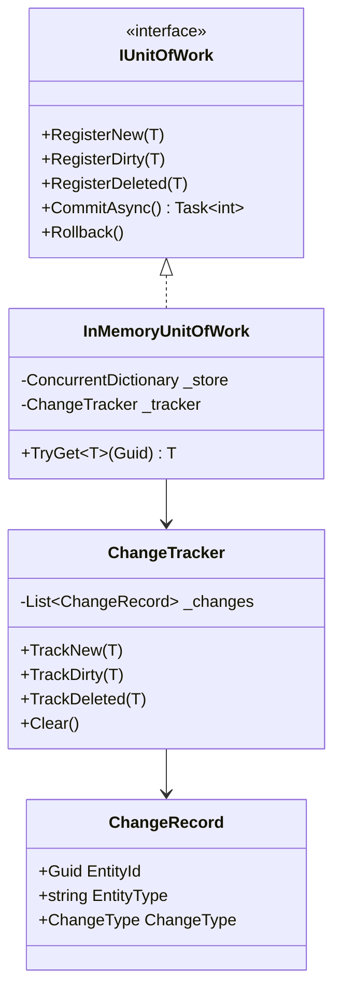
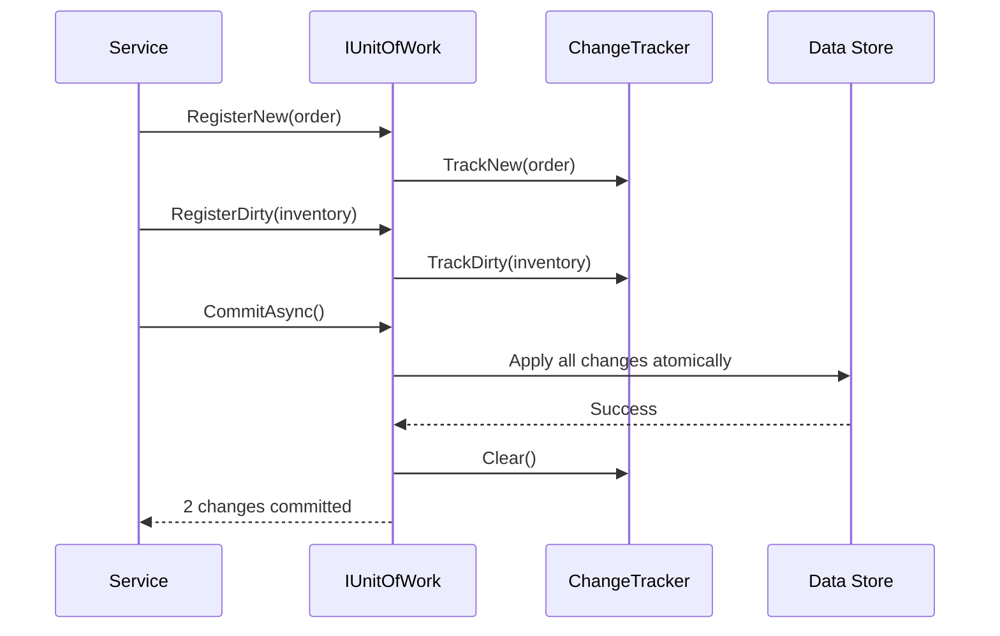

# Unit of Work Pattern

## Memory Hook (one-liner)
"A shopping cart for database changes — you add, edit, and remove items, then commit them all in one transaction."

## Problem
When multiple repositories participate in a business operation, each repository saving independently can leave the system in an inconsistent state if one save fails. You need atomic "all or nothing" semantics.

## Naive Approach
```csharp
// Each repository saves independently — partial failure risk
await _orderRepo.AddAsync(order);       // succeeds
await _inventoryRepo.UpdateAsync(item); // succeeds
await _paymentRepo.AddAsync(payment);   // FAILS — order and inventory are now inconsistent
```

## Pattern Solution
Collect all changes across repositories in a ChangeTracker. On `CommitAsync()`, apply them atomically inside a single transaction. On failure, roll back all changes.

## When To Use
- Multiple aggregates must be modified atomically
- You want audit logging of all changes in a single commit
- Business operations span multiple repositories
- You need optimistic concurrency across related entities
- Testing requires verifying that partial commits never happen

## When NOT To Use
- Single-entity CRUD with no cross-aggregate consistency needs
- EF Core's built-in `SaveChanges()` already provides Unit of Work
- Event-sourced systems where each event is an atomic write
- Microservices where distributed transactions should use Saga instead
- Performance-critical paths where change tracking overhead matters

## Participants
| Role | Class | Purpose |
|------|-------|---------|
| Interface | `IUnitOfWork` | Contract for registering and committing changes |
| Implementation | `InMemoryUnitOfWork` | In-memory change tracking with rollback |
| Entity Contract | `IEntity` | Marker interface requiring stable identity |
| Tracker | `ChangeTracker` | Accumulates pending Insert/Update/Delete records |
| Record | `ChangeRecord` | Immutable snapshot of one pending change |

## Variants
- **EF Core built-in** — DbContext is already a Unit of Work
- **Explicit registration** — caller registers entities manually (shown here)
- **Implicit tracking** — change detection via proxy objects (EF style)
- **Event-based** — Unit of Work publishes domain events on commit

## Tradeoffs Table
| Advantage | Disadvantage |
|-----------|-------------|
| Atomic commits across repositories | Added complexity over simple saves |
| Clean rollback on failure | Memory overhead from change tracking |
| Audit trail of all changes | Can mask the true cost of a transaction |
| Testable without database | Risk of long-lived units of work holding locks |

## Common Interview Questions
1. **How is Unit of Work different from a database transaction?** UoW is an application-level pattern; it collects changes in memory and then opens a DB transaction only at commit time.
2. **Does EF Core implement Unit of Work?** Yes — DbContext tracks changes and SaveChanges commits atomically.
3. **Can you have nested Units of Work?** Generally no — nested transactions are complex. Use a single UoW per business operation.

## Comparison with Similar Patterns
| Pattern | Difference |
|---------|-----------|
| **Repository** | Manages one collection; UoW coordinates across multiple repositories |
| **Transaction Script** | Procedural — no change tracking or rollback abstraction |
| **Saga** | Distributed transactions with compensation; UoW is local |

## Mermaid Diagrams

### Class Diagram


### Sequence Diagram


## Similar Patterns to Review Next
- Repository
- Saga
- Domain Events
