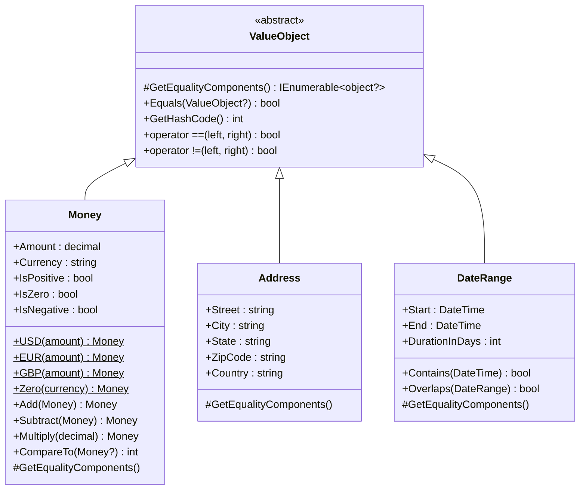
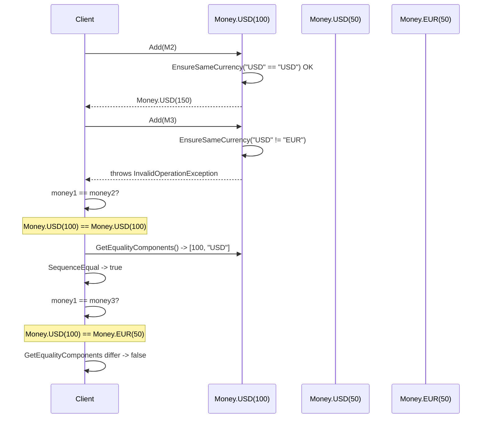

# Value Object Pattern

## Memory Hook
"Two ten-dollar bills are interchangeable" -- objects defined by their attributes, not their identity. Equal values mean equal objects.

## Problem
An e-commerce system handles monetary amounts, addresses, and date ranges. Using primitive types (`decimal` for money, `string` for currency, multiple `string` fields for address) leads to primitive obsession: a method accepts `decimal amount, string currency` but nothing prevents passing an amount in USD where EUR is expected. Two prices cannot be safely added if they are in different currencies. Addresses are compared by reference instead of by their street/city/zip values. Date ranges have no built-in validation that the start precedes the end.

## Naive Approach
Use primitives everywhere: `decimal price`, `string currency`, `string street`, `string city`. Validation logic is duplicated wherever these values are used. Currency mismatch bugs surface only at runtime. Two `Address` objects with identical fields are not considered equal because C# reference equality is the default. Rounding rules for money are applied inconsistently across the codebase.

## Pattern Solution
Create immutable value object classes (`Money`, `Address`, `DateRange`) that extend a `ValueObject` base class. The base class implements equality by comparing the components returned from `GetEqualityComponents()`. `Money` encapsulates amount and currency, prevents arithmetic between different currencies, and applies consistent rounding. `Address` bundles street, city, state, zip, and country into a single immutable unit with structural equality. `DateRange` validates that start is before end and provides overlap detection. Factory methods (`Money.USD(100)`) make construction expressive and safe.

## When To Use
- A concept is defined by its attributes rather than a unique identity (money, coordinates, email, color).
- You need structural equality: two objects with the same values should be considered equal.
- The object should be immutable -- once created, it never changes.
- You want to encapsulate validation and domain rules inside the value (currency matching, date ordering).
- You are suffering from primitive obsession and want to replace primitives with rich domain types.

## When NOT To Use
- The object has a unique identity that matters regardless of its attributes (use Entity instead).
- The object needs to be mutable and tracked over time (e.g., a user profile that changes).
- The overhead of creating a new object for every change is unacceptable in a hot path.
- The concept is truly a single primitive with no additional behavior or validation.
- You are in a CRUD application with no domain logic where value objects add unnecessary complexity.

## Key Participants

| Participant | Role |
|---|---|
| `ValueObject` (Base Class) | Implements `Equals`, `GetHashCode`, `==`, `!=` using `GetEqualityComponents()`. |
| `Money` | Amount + Currency. Arithmetic operations enforce same-currency constraint. Factory methods: `USD()`, `EUR()`, `GBP()`, `Zero()`. Operator overloads for `+`, `-`, `*`, `>`, `<`. |
| `Address` | Street, City, State, ZipCode, Country. Structural equality. Immutable. |
| `DateRange` | Start + End dates. Validates ordering. `Overlaps()`, `Contains()`, `DurationInDays` methods. |

## Variants
- **C# Records:** In modern C#, `record` types provide structural equality out of the box. `Money` could be a `record struct` for stack allocation.
- **Strongly-Typed IDs:** A specialized value object pattern where entity IDs are wrapped in a type (e.g., `OrderId` instead of `Guid`) to prevent mixing different ID types.
- **Enumeration Class:** A value object variant where the set of valid values is fixed and known (e.g., `Currency.USD`, `Currency.EUR`).
- **Self-Validating Value Object:** Throws in the constructor if invariants are violated (e.g., negative money amount, empty email).

## Tradeoffs

| Advantage | Disadvantage |
|---|---|
| Structural equality: `Money.USD(10) == Money.USD(10)` is true. | Creating a new object for every mutation can increase GC pressure. |
| Immutability eliminates a class of concurrency bugs. | More classes than using raw primitives. |
| Domain rules are encapsulated (currency mismatch prevented at compile time). | ORM mapping requires value object configuration (EF Core `OwnsOne`). |
| Self-documenting code: `Money` is clearer than `decimal`. | Serialization/deserialization requires custom converters. |
| Prevents primitive obsession and invalid states. | Equality comparison is slightly slower than reference equality. |

## Common Interview Questions
1. What is the difference between a Value Object and an Entity in Domain-Driven Design?
2. How do you persist Value Objects with Entity Framework Core (owned types, complex types)?
3. Why should Value Objects be immutable, and what are the consequences if they are not?

## Comparison with Similar Patterns

| Aspect | Value Object | Entity |
|---|---|---|
| Identity | Defined by attribute values. No unique ID. | Has a unique identity (ID) that persists over time. |
| Equality | Structural: equal if all attributes match. | Identity: equal only if IDs match. |
| Mutability | Immutable. Changes produce a new instance. | Mutable. State changes over its lifecycle. |
| Lifecycle | No independent lifecycle. Created and discarded freely. | Tracked lifecycle. Created, updated, deleted. |
| Example | Money(100, "USD"), Address("123 Main St", ...) | Order(id=42), Customer(id=7) |
| Persistence | Stored as part of an entity (owned type). | Stored as its own row with a primary key. |

## Mermaid Class Diagram

## Mermaid Sequence Diagram

## Similar Patterns to Review Next
- **Entity** -- has identity-based equality; Value Objects are attribute-based. Often contains Value Objects as properties.
- **Specification** -- encapsulates business rules as composable objects; works well with Value Objects for validation.
- **Strongly-Typed ID** -- a specialized Value Object that wraps entity identifiers to prevent ID mixups.
- **Money Pattern (Fowler)** -- a well-known application of the Value Object pattern specifically for monetary amounts.
