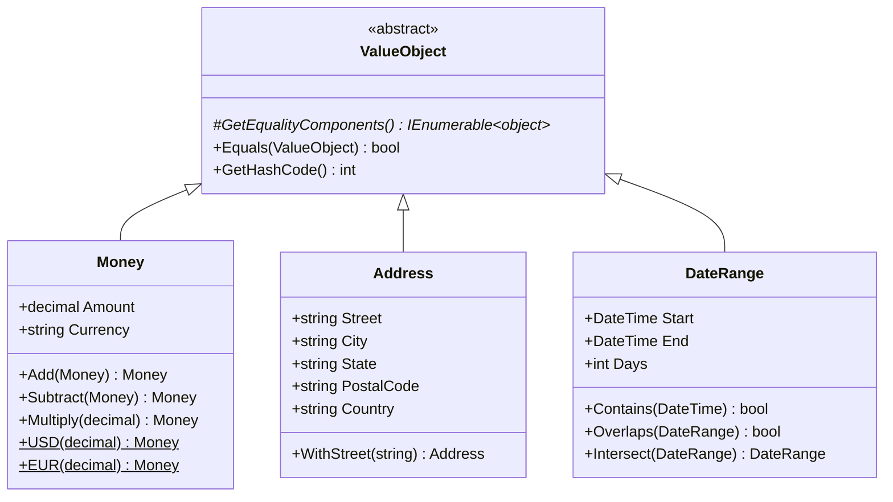
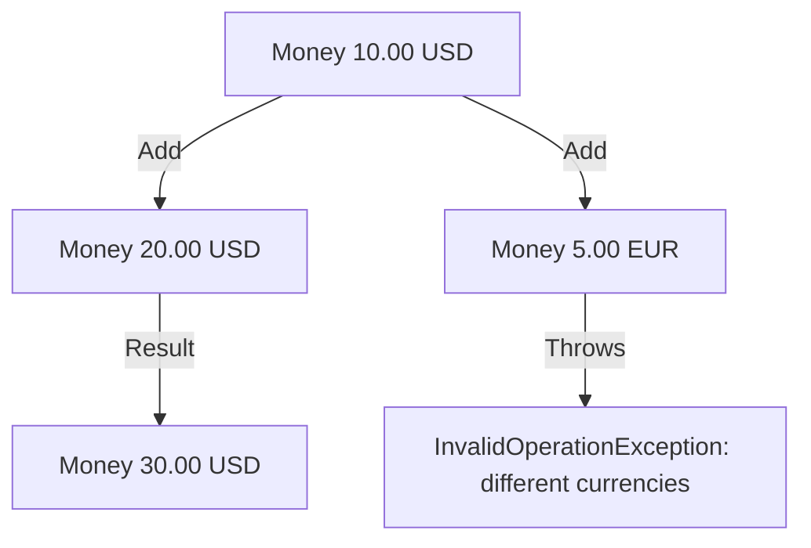

# Value Object Pattern

## Memory Hook (one-liner)
"Objects defined by what they are, not who they are — two $10 bills are interchangeable, but two people named John are not."

## Problem
Primitive obsession: using `decimal` for money loses currency info, using `string` for addresses loses structure, and equality checks become error-prone. Domain concepts get scattered across primitive fields instead of being modeled explicitly.

## Naive Approach
```csharp
public class Order
{
    public decimal Price { get; set; }          // What currency?
    public string ShippingStreet { get; set; }  // Scattered address fields
    public string ShippingCity { get; set; }
    public string ShippingState { get; set; }
    // price1 == price2 when they happen to be the same decimal, even if currencies differ!
}
```

## Pattern Solution
Create immutable types that are compared by their attribute values, not by reference/identity. `Money(10, "USD") == Money(10, "USD")` is true. Cross-currency arithmetic throws. Addresses are replaced atomically via `WithStreet()`.

## When To Use
- Domain concepts with no identity (money, addresses, date ranges, coordinates)
- You need to prevent invalid states (negative money, end before start)
- Equality should be based on attributes, not reference
- Arithmetic or comparison operations belong to the concept itself
- Replacing primitive obsession with rich domain types

## When NOT To Use
- The concept has a lifecycle and identity (use Entity instead)
- You need mutability for performance (value objects are immutable)
- The type is a simple wrapper with no domain behavior
- DTOs that are just data carriers without invariants
- Overhead of custom equality is not justified for internal data structures

## Participants
| Role | Class | Purpose |
|------|-------|---------|
| Base Class | `ValueObject` | Equality by components |
| Money | `Money` | Amount + currency with arithmetic |
| Address | `Address` | Immutable postal address |
| DateRange | `DateRange` | Inclusive date range with overlap/intersection |

## Variants
- **Record-based** — C# records provide value equality out of the box
- **Base-class approach** — abstract `GetEqualityComponents()` (shown here)
- **Struct-based** — value types for stack allocation
- **Flyweight** — shared instances for common values (e.g., `Money.Zero("USD")`)

## Tradeoffs Table
| Advantage | Disadvantage |
|-----------|-------------|
| Rich domain modeling | More classes than primitives |
| Self-validating (invariants enforced) | Immutability means new allocations on change |
| Type-safe (no USD + EUR accidents) | Mapping to/from persistence requires converters |
| Equality based on meaning, not reference | Learning curve for teams used to primitives |

## Common Interview Questions
1. **Value Object vs Entity?** Value Objects have no identity and are compared by attributes. Entities have a stable identity (ID).
2. **Why immutability?** Prevents accidental side effects. If you change a Money value, you get a new Money — the original is unchanged.
3. **How do you persist Value Objects with EF Core?** Use `OwnsOne()` (complex type) or value converters.

## Comparison with Similar Patterns
| Pattern | Difference |
|---------|-----------|
| **Entity** | Has identity; Value Object does not |
| **DTO** | DTO is a data carrier; Value Object enforces invariants |
| **Record (C#)** | Records provide value equality automatically; Value Objects add domain behavior |

## Mermaid Diagrams

### Class Diagram


### Flow Diagram


## Similar Patterns to Review Next
- Result Pattern (both enforce domain invariants)
- Specification (composable rules over domain types)
- Repository (persistence of value objects)
