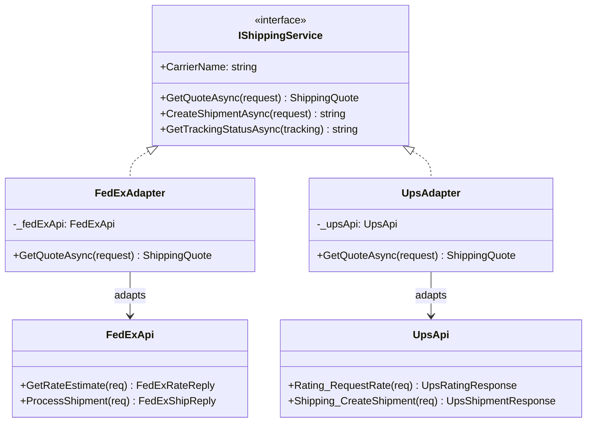
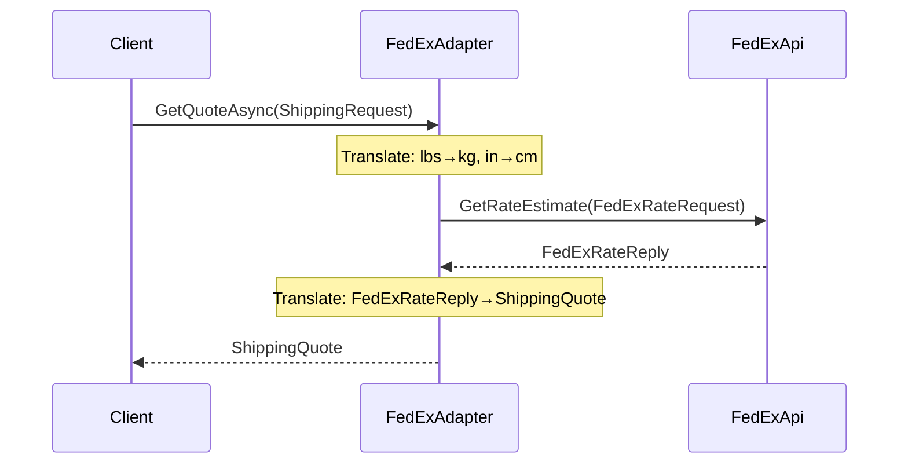

# Adapter Pattern

## Memory Hook (one-liner)
**"The travel power adapter of code"** — makes incompatible interfaces work together without changing either side.

## Problem
Your e-commerce platform needs to integrate with multiple shipping carriers (FedEx, UPS, DHL). Each carrier provides its own SDK with completely different:
- Method names (`GetRateEstimate` vs `Rating_RequestRate`)
- Data formats (metric vs imperial units)
- Property naming conventions (PascalCase vs underscore_separated)
- Authentication schemes

Without a pattern, every piece of code that touches shipping would need carrier-specific `if/else` branches, and adding a new carrier would require modifying every call site.

## Naive Approach
```csharp
// Scattered carrier-specific logic everywhere
if (carrier == "FedEx")
{
    var fedEx = new FedExApi();
    var req = new FedExRateRequest { PackageWeightKg = lbs * 0.453592, ... };
    var reply = fedEx.GetRateEstimate(req);
    price = reply.TotalNetCharge;
}
else if (carrier == "UPS")
{
    var ups = new UpsApi();
    var req = new UpsRatingRequest { Shipment_Weight_Lbs = lbs, ... };
    var reply = ups.Rating_RequestRate(req);
    price = reply.RatedShipment_TotalCharges;
}
// Adding DHL means touching EVERY method that uses shipping...
```

## Pattern Solution
Define a unified `IShippingService` interface. Create an adapter for each carrier that:
1. Implements the unified interface
2. Holds a reference to the third-party API (object adapter) or inherits from it (class adapter)
3. Translates between your domain model and the carrier's API format

Client code works exclusively with `IShippingService` — it never knows which carrier it's talking to.

## When To Use
- Integrating with third-party libraries/APIs that you cannot modify
- Unifying multiple services behind a common interface (payment gateways, shipping carriers, notification providers)
- Wrapping legacy code to conform to a new interface without rewriting it
- Enabling polymorphic treatment of classes with incompatible interfaces
- Supporting dependency injection by adapting concrete classes to interfaces

## When NOT To Use
- When you control both interfaces and can simply make them compatible
- When a simple method call delegation would suffice (no translation needed)
- When the adapted interface is likely to change frequently (adapter maintenance cost)
- When you need to add new behavior — use Decorator instead
- When the incompatibility is trivial (e.g., just a method rename) — consider a simple wrapper method

## Participants
| Participant | Role | In Our Example |
|---|---|---|
| **Target** | The interface the client expects | `IShippingService` |
| **Adaptee** | The existing class with an incompatible interface | `FedExApi`, `UpsApi` |
| **Adapter** | Translates between Target and Adaptee | `FedExAdapter`, `UpsAdapter` |
| **Client** | Works with the Target interface | Any service needing shipping quotes |

## Variants
- **Object Adapter (Composition)**: Holds a reference to the adaptee. Preferred in C# — more flexible, can adapt multiple adaptees.
- **Class Adapter (Inheritance)**: Inherits from the adaptee. Limited by single inheritance in C#; shown in `FedExClassAdapter`.
- **Two-Way Adapter**: Implements both interfaces, allowing either side to call the other.

## Tradeoffs Table
| Aspect | Advantage | Disadvantage |
|---|---|---|
| **Decoupling** | Client code is insulated from third-party API changes | Extra layer of indirection |
| **Open/Closed** | Add new carriers without modifying existing code | Each new carrier requires a new adapter class |
| **Unit Testing** | Easy to mock `IShippingService` for tests | Must also test each adapter's translation logic |
| **Object vs Class** | Object adapter is more flexible (composition) | Class adapter has less indirection but locks you in |
| **Complexity** | Simple pattern, easy to understand | Can proliferate if every tiny difference gets its own adapter |

## Common Interview Questions
1. **What's the difference between Adapter and Facade?** Adapter makes one interface look like another; Facade simplifies a complex subsystem into a single interface.
2. **Object adapter vs class adapter?** Object adapter uses composition (preferred in C#); class adapter uses inheritance (limited by single inheritance).
3. **When would you use Adapter over Decorator?** Adapter changes the interface; Decorator enhances behavior while keeping the same interface.
4. **Can an adapter adapt multiple adaptees?** Object adapters can hold references to multiple adaptees; class adapters cannot (single inheritance).
5. **How does Adapter relate to Dependency Injection?** Adapters are often registered in DI containers, allowing runtime selection of implementations.

## Comparison with Similar Patterns
| Pattern | Purpose | Key Difference |
|---|---|---|
| **Adapter** | Make incompatible interfaces compatible | Changes the interface |
| **Decorator** | Add behavior to existing interface | Same interface, enhanced behavior |
| **Facade** | Simplify a complex subsystem | Defines a new, simpler interface |
| **Bridge** | Decouple abstraction from implementation | Designed upfront, not retrofitted |
| **Proxy** | Control access to an object | Same interface, controlled access |

## Mermaid Diagrams

### Class Diagram


### Sequence Diagram


## Similar Patterns to Review Next
- **Bridge** — Similar separation of concerns, but designed upfront rather than retrofitted
- **Facade** — Also simplifies interfaces, but for an entire subsystem
- **Decorator** — Wraps objects like Adapter but to add behavior, not change interfaces
- **Strategy** — Often used with Adapter when selecting among multiple adapted services at runtime
