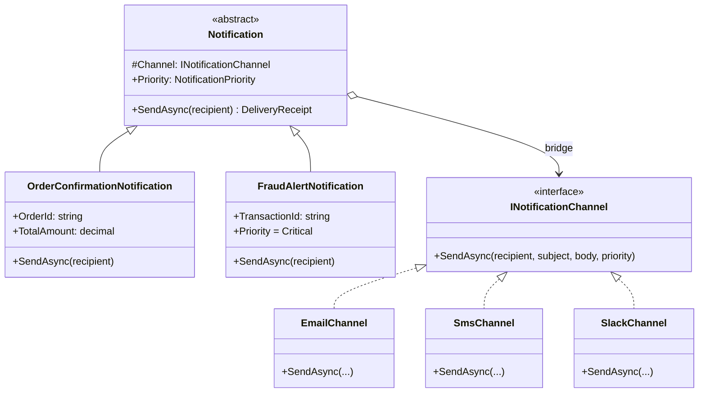
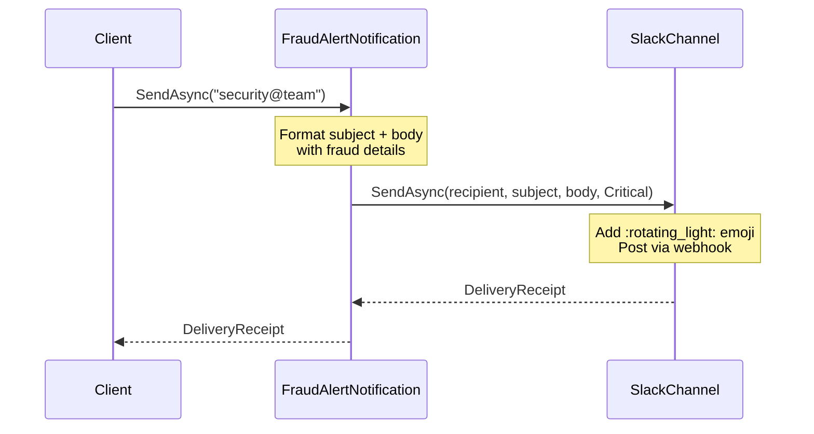

# Bridge Pattern

## Memory Hook (one-liner)
**"Two dimensions of variation, one pattern"** — lets you vary WHAT you send (notification type) independently from HOW you send it (delivery channel).

## Problem
Your notification system needs to send different types of notifications (OrderConfirmation, ShipmentUpdate, FraudAlert) through different channels (Email, SMS, Push, Slack). Without Bridge, you'd face a class explosion:
- `OrderConfirmationEmail`, `OrderConfirmationSms`, `OrderConfirmationPush`, `OrderConfirmationSlack`
- `ShipmentUpdateEmail`, `ShipmentUpdateSms`, `ShipmentUpdatePush`, `ShipmentUpdateSlack`
- `FraudAlertEmail`, `FraudAlertSms`, `FraudAlertPush`, `FraudAlertSlack`

That's **M x N** classes (3 types x 4 channels = 12). Adding a new notification type or channel requires adding an entire row or column of classes.

## Naive Approach
```csharp
// Class explosion: one class per combination
class OrderConfirmationEmail : Notification { ... }
class OrderConfirmationSms : Notification { ... }
class FraudAlertSlack : Notification { ... }
// 12+ classes, each with duplicated formatting AND delivery logic
```

## Pattern Solution
Separate the two dimensions of variation:
1. **Abstraction** (Notification) — defines WHAT to send (content formatting, priority)
2. **Implementation** (INotificationChannel) — defines HOW to deliver (Email, SMS, Push, Slack)

Connect them via composition: each Notification holds a reference to an INotificationChannel. Now you have **M + N** classes (3 types + 4 channels = 7) instead of M x N.

## When To Use
- You have two orthogonal dimensions of variation (what vs how, platform vs feature)
- You want to avoid a Cartesian product of subclasses
- Both dimensions need to be extensible independently at runtime
- You want to switch implementations at runtime (e.g., change delivery channel per user preference)
- You need to share an implementation across multiple abstractions

## When NOT To Use
- Only one dimension varies — simpler inheritance or Strategy suffices
- The two dimensions are tightly coupled and always change together
- You have a small, fixed number of combinations (2-3 total)
- The overhead of the extra abstraction layer isn't justified by the flexibility
- When the "implementation" side has no meaningful variation

## Participants
| Participant | Role | In Our Example |
|---|---|---|
| **Abstraction** | Defines the abstraction's interface; holds ref to Implementor | `Notification` |
| **Refined Abstraction** | Extends the abstraction with specific behavior | `OrderConfirmationNotification`, `FraudAlertNotification` |
| **Implementor** | Defines the interface for implementation classes | `INotificationChannel` |
| **Concrete Implementor** | Provides specific implementation | `EmailChannel`, `SmsChannel`, `PushChannel`, `SlackChannel` |

## Variants
- **Simple Bridge**: Abstraction delegates directly to implementor (our example).
- **Multi-Implementation Bridge**: Abstraction holds multiple implementors (e.g., send to both Email AND Slack).
- **Bridge with Abstract Factory**: Factory creates matching abstraction + implementor pairs.

## Tradeoffs Table
| Aspect | Advantage | Disadvantage |
|---|---|---|
| **Extensibility** | Add new notification types OR channels independently | Two hierarchies to maintain |
| **Class Count** | M + N instead of M x N classes | Slightly more complex initial design |
| **Runtime Flexibility** | Swap channels at runtime per user preference | Extra indirection on every call |
| **Testing** | Test types and channels independently | Need integration tests for combinations |
| **Design Upfront** | Clean separation when designed from the start | Harder to retrofit than Adapter |

## Common Interview Questions
1. **Bridge vs Strategy?** Bridge separates abstraction from implementation in a class hierarchy; Strategy swaps algorithms. Bridge is structural, Strategy is behavioral.
2. **Bridge vs Adapter?** Bridge is designed upfront to split abstractions; Adapter is retrofitted to make existing interfaces compatible.
3. **When does Bridge become overkill?** When you have fewer than 3 combinations of abstraction x implementation.
4. **How does Bridge relate to Dependency Injection?** The channel (implementation) is injected into the notification (abstraction) — DI is the mechanism, Bridge is the design.
5. **Can you have multiple implementors?** Yes — a notification could send through multiple channels simultaneously.

## Comparison with Similar Patterns
| Pattern | Purpose | Key Difference |
|---|---|---|
| **Bridge** | Decouple abstraction from implementation | Two independent hierarchies |
| **Strategy** | Swap algorithms | Single hierarchy, algorithm injection |
| **Adapter** | Make interfaces compatible | Retrofitted, not designed upfront |
| **Abstract Factory** | Create families of related objects | Often used WITH Bridge |
| **Template Method** | Define algorithm skeleton in base class | Uses inheritance, not composition |

## Mermaid Diagrams

### Class Diagram


### Sequence Diagram


## Similar Patterns to Review Next
- **Strategy** — The behavioral counterpart; swaps algorithms rather than splitting hierarchies
- **Abstract Factory** — Often used with Bridge to create matching abstraction/implementation pairs
- **Adapter** — The retrofitted version of Bridge; makes existing interfaces work together
- **Decorator** — Can wrap Bridge components to add cross-cutting behavior (logging, metrics)
