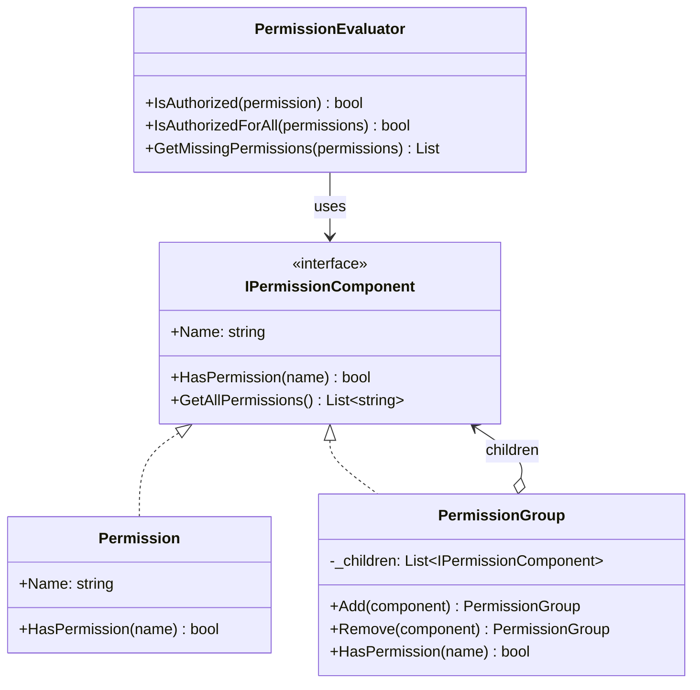
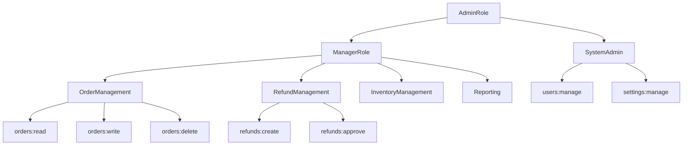

# Composite Pattern

## Memory Hook (one-liner)
**"Treat one and many the same way"** — a single permission and a group of permissions both answer "do you have this permission?" identically.

## Problem
Your authorization system needs to manage permissions hierarchically:
- Individual permissions: `orders:read`, `orders:write`, `refunds:approve`
- Permission groups: `OrderManagement` (contains all order permissions)
- Role groups: `ManagerRole` (contains OrderManagement + InventoryManagement + Reporting)

Client code that checks authorization shouldn't need to know whether it's checking against a single permission, a group, or a deeply nested hierarchy. The question is always the same: "Does the user have permission X?"

## Naive Approach
```csharp
// Client must know the structure and iterate manually
bool IsAuthorized(User user, string permission)
{
    foreach (var p in user.DirectPermissions)
        if (p.Name == permission) return true;
    foreach (var group in user.PermissionGroups)
        foreach (var p in group.Permissions)
            if (p.Name == permission) return true;
        foreach (var subGroup in group.SubGroups) // How deep does it go?
            // Recursive nightmare...
}
```

## Pattern Solution
Define `IPermissionComponent` with a `HasPermission()` method. Both `Permission` (leaf) and `PermissionGroup` (composite) implement it. The composite delegates to its children recursively. Client code calls `HasPermission()` on the root — the tree handles the rest.

## When To Use
- You need to represent part-whole hierarchies (files/folders, org charts, UI component trees)
- Client code should treat individual objects and compositions uniformly
- The structure forms a tree where operations apply recursively
- You want to add new leaf or composite types without changing client code
- You need to traverse or aggregate over a tree structure

## When NOT To Use
- The structure is flat (no nesting) — a simple list suffices
- Leaf and composite operations are fundamentally different (violates uniformity goal)
- You need to enforce strict typing about what can contain what
- The tree is extremely deep and performance-critical (recursive calls have stack overhead)
- When the common interface forces unnatural methods on leaves (e.g., `Add()` on a leaf)

## Participants
| Participant | Role | In Our Example |
|---|---|---|
| **Component** | Common interface for leaves and composites | `IPermissionComponent` |
| **Leaf** | Atomic element with no children | `Permission` |
| **Composite** | Container that holds and delegates to children | `PermissionGroup` |
| **Client** | Works with components through the Component interface | `PermissionEvaluator` |

## Variants
- **Transparent Composite**: Component interface includes `Add()`/`Remove()` — all nodes look the same but leaves throw on child operations.
- **Safe Composite** (our approach): Only Composite has `Add()`/`Remove()` — type-safe but client must cast to add children.
- **Composite with Visitor**: Combine with Visitor pattern for operations that vary by node type.

## Tradeoffs Table
| Aspect | Advantage | Disadvantage |
|---|---|---|
| **Uniformity** | Client treats leaves and composites the same | May need type checks when adding children |
| **Extensibility** | Easy to add new leaf or composite types | Hard to restrict what types of children a composite accepts |
| **Recursion** | Natural tree traversal | Deep trees can cause stack overflow |
| **Simplicity** | Client code is simple — just call the root | Composite itself can be complex (cycle detection, dedup) |
| **Flexibility** | Dynamic tree building at runtime | Harder to enforce static structure constraints |

## Common Interview Questions
1. **Where is Composite used in .NET?** `System.Windows.Forms.Control` (UI tree), `System.Xml.XmlNode`, `System.IO.DirectoryInfo` (file system).
2. **How do you prevent cycles?** Check ancestry before adding (our `ContainsCycle` method), or use immutable trees.
3. **Transparent vs Safe Composite?** Transparent: `Add()` on interface (throws for leaves). Safe: `Add()` only on Composite class (requires cast).
4. **Composite vs Decorator?** Composite builds trees with multiple children; Decorator wraps a single component. Both use recursive composition.
5. **How does Composite support the Open/Closed Principle?** New leaf and composite types can be added without modifying existing code or the client.

## Comparison with Similar Patterns
| Pattern | Purpose | Key Difference |
|---|---|---|
| **Composite** | Tree structure with uniform interface | Multiple children, part-whole hierarchy |
| **Decorator** | Wrap single object to add behavior | Single child, same interface, added behavior |
| **Chain of Responsibility** | Pass request through a chain | Linear chain, not a tree |
| **Iterator** | Traverse a collection | Flattens traversal; often used WITH Composite |
| **Visitor** | Add operations to a structure | Often used WITH Composite for type-specific ops |

## Mermaid Diagrams

### Class Diagram


### Tree Structure Example


## Similar Patterns to Review Next
- **Decorator** — Also uses recursive composition but wraps a single object to add behavior
- **Iterator** — Used to traverse Composite trees in a flat sequence
- **Visitor** — Adds operations to Composite structures without modifying node classes
- **Chain of Responsibility** — Linear version of recursive delegation
