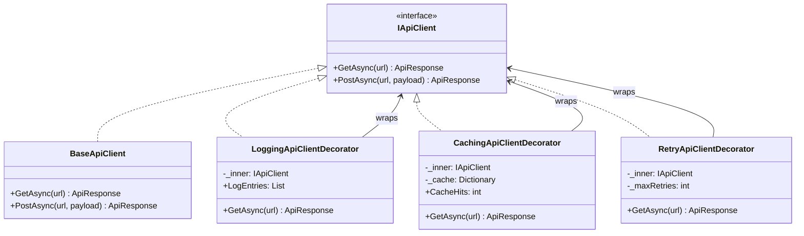
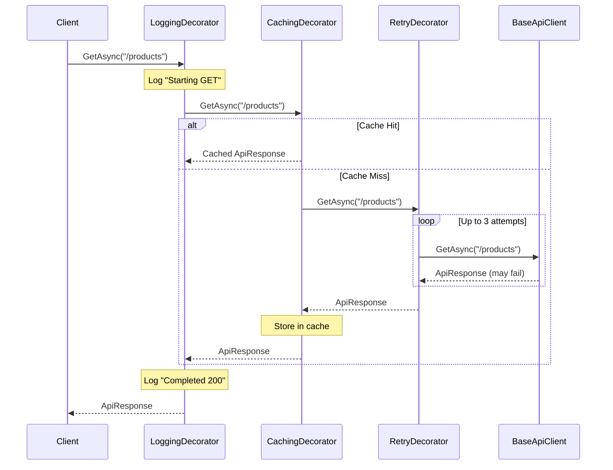

# Decorator Pattern

## Memory Hook (one-liner)
**"Russian nesting dolls for behavior"** — wrap an object with layers that each add one responsibility, without changing the original.

## Problem
Your API client needs cross-cutting concerns: logging, caching, retry with backoff, and circuit breaking. You could add all this logic to the base client, but that violates Single Responsibility. You could use inheritance (`LoggingApiClient extends BaseApiClient`), but then how do you get `LoggingCachingRetryApiClient`? You'd need 2^N subclasses for N behaviors.

## Naive Approach
```csharp
// God class with all concerns
class ApiClient
{
    public async Task<Response> GetAsync(string url)
    {
        _logger.Log($"Starting GET {url}");          // logging
        if (_cache.TryGet(url, out var cached))       // caching
            return cached;
        for (int retry = 0; retry < 3; retry++)       // retry
        {
            try { return await _http.GetAsync(url); }
            catch { await Task.Delay(100 * retry); }
        }
        // 100+ lines of intertwined concerns...
    }
}
```

## Pattern Solution
Each concern becomes a separate decorator that implements `IApiClient` and wraps another `IApiClient`:
- `LoggingApiClientDecorator` logs requests/responses, delegates to inner
- `CachingApiClientDecorator` checks cache before delegating to inner
- `RetryApiClientDecorator` retries on failure before returning

Compose them like layers: `Logging(Caching(Retry(BaseClient)))`. Each layer adds one behavior.

## When To Use
- You need to add responsibilities to objects dynamically at runtime
- Extension by inheritance is impractical (too many combinations)
- Cross-cutting concerns (logging, caching, auth, metrics) need to be composable
- You want to add/remove behaviors without affecting other objects of the same class
- The same interface must be preserved while adding behavior

## When NOT To Use
- When you need to change the interface, not just add behavior (use Adapter)
- When the decorators depend on each other's internal state
- When order of decoration matters and is hard to get right
- When a simple method override in a subclass would suffice
- When the number of decorators is always the same (just put the logic inline)

## Participants
| Participant | Role | In Our Example |
|---|---|---|
| **Component** | Interface defining the contract | `IApiClient` |
| **Concrete Component** | The original object being decorated | `BaseApiClient` |
| **Decorator** | Wraps a Component and adds behavior | `LoggingApiClientDecorator`, `CachingApiClientDecorator` |
| **Client** | Uses Components through the interface | `ApiClientFactory`, application code |

## Variants
- **Transparent Decorator**: Decorator inherits from Component (abstract class), pre-wires delegation.
- **Interface Decorator** (our approach): Each decorator implements the interface independently.
- **Decorator with DI**: Register decorators in the IoC container using `.Decorate<IApiClient, LoggingDecorator>()`.

## Tradeoffs Table
| Aspect | Advantage | Disadvantage |
|---|---|---|
| **Composability** | Mix and match behaviors freely | Decoration order matters (logging before vs after caching) |
| **Single Responsibility** | Each decorator does one thing | Many small classes to manage |
| **Open/Closed** | Add new behaviors without modifying existing code | Harder to debug — behavior spread across layers |
| **Runtime Flexibility** | Add/remove behaviors at runtime | Configuration complexity increases |
| **Testing** | Test each decorator in isolation | Integration testing of the full chain is essential |

## Common Interview Questions
1. **Decorator vs Proxy?** Decorator adds behavior; Proxy controls access. Proxy usually creates/manages the wrapped object; Decorator receives it.
2. **Decorator vs Middleware?** ASP.NET middleware IS the Decorator pattern applied to the HTTP pipeline. Same concept, different context.
3. **How does decoration order matter?** In our example: Logging wraps Caching wraps Retry. Logging sees cache hits, Retry only sees actual HTTP calls.
4. **Decorator in .NET?** `Stream` (BufferedStream, CryptoStream), `HttpMessageHandler` (DelegatingHandler), ASP.NET middleware pipeline.
5. **How to handle decorator ordering in DI?** Libraries like Scrutor provide `.Decorate<>()` methods; order of registration = order of wrapping.

## Comparison with Similar Patterns
| Pattern | Purpose | Key Difference |
|---|---|---|
| **Decorator** | Add behavior to an object | Same interface, enhanced behavior |
| **Proxy** | Control access to an object | Same interface, controlled access |
| **Adapter** | Change an object's interface | Different interface, same behavior |
| **Composite** | Compose objects into tree structures | Multiple children vs single wrapped object |
| **Chain of Responsibility** | Pass request through handlers | Linear chain, may short-circuit |

## Mermaid Diagrams

### Class Diagram


### Decoration Chain


## Similar Patterns to Review Next
- **Proxy** — Same wrapping structure but for access control, not behavior addition
- **Chain of Responsibility** — The behavioral version of chained decorators
- **Strategy** — Alternative when you want to swap a single algorithm, not layer behaviors
- **Composite** — Uses similar recursive composition but for tree structures
