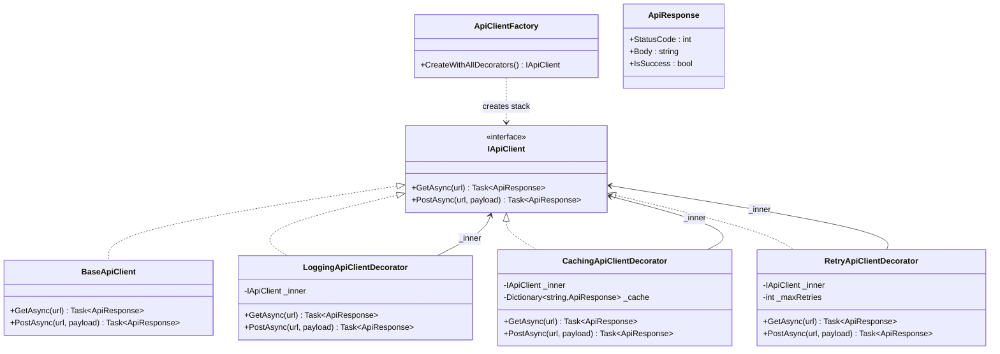
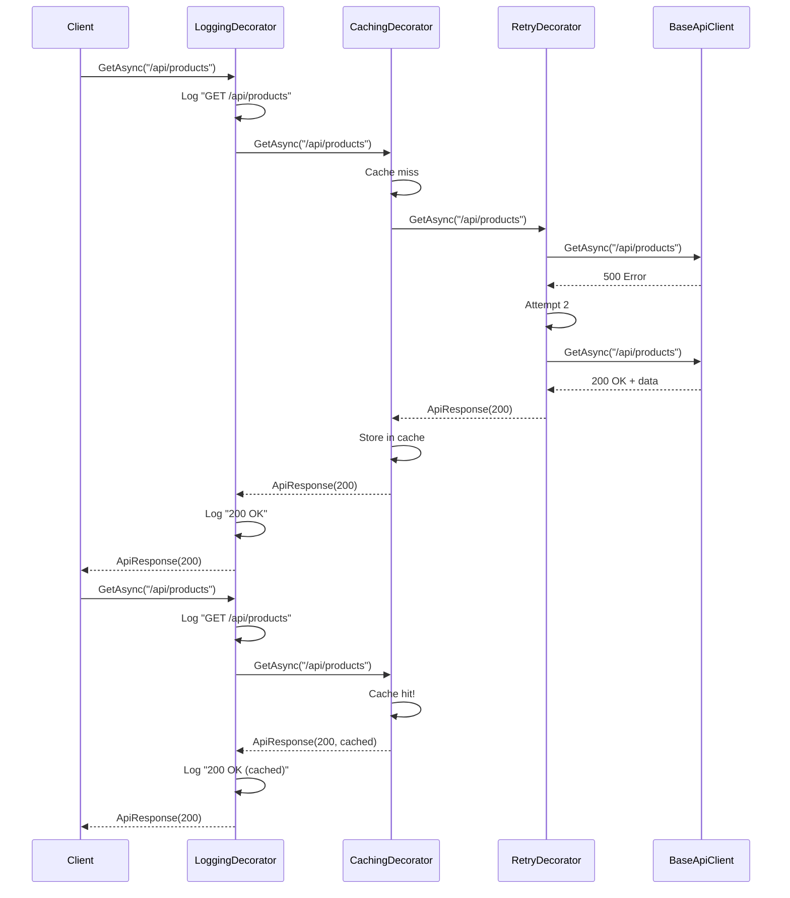

# Decorator Pattern

## Memory Hook
"Wrap it to extend it" -- add behavior to an object by wrapping it in a decorator that implements the same interface, without modifying the original class.

## Problem
An API client needs cross-cutting capabilities: logging every request/response, caching GET responses, and retrying failed requests. These behaviors should be independently toggleable, composable, and testable. Without the Decorator pattern, each feature gets baked into the `BaseApiClient` class with boolean flags and conditional logic, producing a monolithic class that violates the Single Responsibility Principle and is impossible to extend without modification.

## Naive Approach
The `BaseApiClient` class grows to include `if (_enableLogging) { ... }`, `if (_enableCaching) { ... }`, and `if (_enableRetry) { ... }` in every method. Adding a new cross-cutting concern (e.g., circuit breaking) means modifying the same class again. Testing caching in isolation requires constructing the full client with the other features disabled. The combinatorial explosion of feature flags makes the class brittle and hard to reason about.

## Pattern Solution
Define an `IApiClient` interface with `GetAsync` and `PostAsync` methods. The `BaseApiClient` implements the core HTTP logic. Each cross-cutting concern is a decorator class that implements `IApiClient`, wraps another `IApiClient`, and adds its behavior before/after delegating to the wrapped client. `LoggingApiClientDecorator` logs requests and responses. `CachingApiClientDecorator` caches GET results. `RetryApiClientDecorator` retries on failure. Decorators are composed via nesting: `new LoggingDecorator(new CachingDecorator(new RetryDecorator(new BaseApiClient())))`. An `ApiClientFactory` assembles the desired decorator stack.

## When To Use
- You need to add responsibilities to an object dynamically at runtime without modifying its class.
- Multiple orthogonal behaviors can be mixed and matched in different combinations.
- You want each behavior to be independently testable and deployable.
- Inheritance would lead to a combinatorial explosion of subclasses (LoggingCachingClient, LoggingRetryClient, etc.).
- The behavior additions wrap the original operation with before/after logic (cross-cutting concerns).

## When NOT To Use
- There is only one extension and a simple subclass is clearer.
- The decorators need to interact with each other in complex ways (use a pipeline or middleware pattern).
- The interface has too many methods, making every decorator implementation verbose.
- Performance is critical and the indirection of multiple wrapped calls is unacceptable.
- The ordering of decorators creates subtle bugs that are hard to diagnose.

## Key Participants

| Participant | Role |
|---|---|
| `IApiClient` (Component Interface) | Declares `GetAsync(url)` and `PostAsync(url, payload)` returning `ApiResponse`. |
| `BaseApiClient` (Concrete Component) | Core HTTP implementation without any cross-cutting concerns. |
| `LoggingApiClientDecorator` | Logs request URL, method, and response status before/after delegating. |
| `CachingApiClientDecorator` | Caches GET responses by URL; returns cached result on subsequent calls. |
| `RetryApiClientDecorator` | Retries the wrapped call on failure with configurable retry count and delay. |
| `ApiClientFactory` | Assembles the decorator stack based on configuration. |
| `ApiResponse` | Response DTO with status code, body, and metadata. |

## Variants
- **Abstract Decorator Base Class:** A base decorator class that implements `IApiClient` by forwarding all calls to the wrapped client. Concrete decorators override only the methods they enhance. Reduces boilerplate.
- **DI-Based Decoration:** Use the `Scrutor` library or manual DI registration to decorate services: `services.Decorate<IApiClient, LoggingApiClientDecorator>()`.
- **Middleware Pipeline:** ASP.NET Core middleware is a form of decoration where each middleware wraps the next in the pipeline.
- **Stream Decorators:** .NET's `BufferedStream`, `GZipStream`, `CryptoStream` are classic decorator examples wrapping `Stream`.

## Tradeoffs

| Advantage | Disadvantage |
|---|---|
| Behaviors are independently composable and testable. | Many small decorator classes can be harder to navigate than a single class. |
| New behaviors can be added without modifying existing code. | The order of decoration matters and can introduce subtle bugs. |
| Single Responsibility: each decorator does one thing. | Debugging requires tracing through multiple wrapper layers. |
| Works naturally with dependency injection. | All decorators must implement the full interface, even for methods they do not enhance. |
| No combinatorial subclass explosion. | Identity comparison breaks: the decorated object is not the same reference as the inner object. |

## Common Interview Questions
1. How does the Decorator pattern differ from the Proxy pattern, given that both wrap an object behind the same interface?
2. How would you register decorators in an ASP.NET Core DI container?
3. What problems arise when the order of decorators matters (e.g., should logging wrap caching, or caching wrap logging)?

## Comparison with Similar Patterns

| Aspect | Decorator | Proxy |
|---|---|---|
| Intent | Add new behavior dynamically. | Control access to the object (lazy loading, auth, caching). |
| Composition | Multiple decorators are typically stacked. | Usually a single proxy wraps the real object. |
| Transparency | Client uses the same interface; unaware of decoration. | Client uses the same interface; unaware of proxy. |
| Focus | Enhancing functionality (logging, metrics, retry). | Access control, lazy initialization, remote access. |
| Multiplicity | Many decorators composed in a chain. | Typically one proxy per concern. |
| Who creates | Often assembled by a factory or DI container. | Often created by a factory or DI container. |

## Mermaid Class Diagram

## Mermaid Sequence Diagram

## Similar Patterns to Review Next
- **Proxy** -- wraps an object for access control or lazy loading; structurally identical but with different intent.
- **Chain of Responsibility** -- passes a request along a chain of handlers; each handler decides whether to process or forward.
- **Strategy** -- selects an algorithm; Decorator adds behavior without replacing the core algorithm.
- **Composite** -- composes objects into trees; Decorator composes objects into a linear chain.
