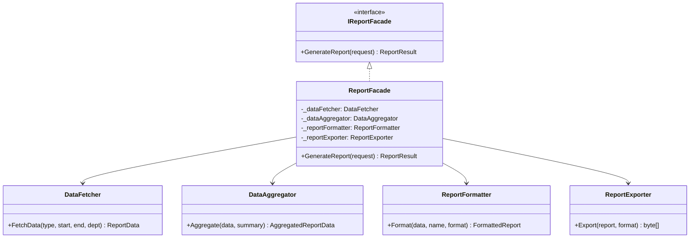
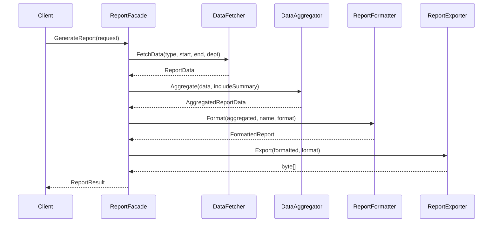

# Facade Pattern

## Memory Hook (one-liner)
**"One button to rule them all"** — a single `GenerateReport()` call hides four subsystems working behind the scenes.

## Problem
Generating a business report requires coordinating multiple subsystems:
1. **DataFetcher** — queries the appropriate database based on report type
2. **DataAggregator** — computes summaries, groups, and statistics
3. **ReportFormatter** — converts data into HTML, CSV, or PDF format
4. **ReportExporter** — serializes the formatted report to bytes

Without a facade, every controller, service, or background job that needs a report must know all four subsystems, call them in the correct order, and pass intermediate results between them.

## Naive Approach
```csharp
// Every call site duplicates this orchestration
var data = dataFetcher.FetchData(type, start, end, dept);
var aggregated = dataAggregator.Aggregate(data, includeSummary);
var formatted = reportFormatter.Format(aggregated, name, format);
var bytes = reportExporter.Export(formatted, format);
var extension = reportExporter.GetFileExtension(format);
// Error handling? Timing? Logging? Repeated in every call site...
```

## Pattern Solution
Create `ReportFacade` with a single `GenerateReport(ReportRequest)` method that orchestrates all four subsystems internally. Client code provides a simple request and receives a complete result — no knowledge of subsystems required.

## When To Use
- A subsystem has grown complex and clients need a simplified entry point
- You want to layer your system — facade is the entry point to each layer
- You need to reduce coupling between clients and a complex set of classes
- Multiple clients duplicate the same orchestration of subsystem calls
- You want to provide a "good enough" default workflow while still allowing direct subsystem access for power users

## When NOT To Use
- The subsystem is already simple (1-2 classes) — facade adds unnecessary indirection
- Clients legitimately need fine-grained control over every step
- The facade becomes a "god class" doing too much — split into multiple facades
- When the subsystem's API is already well-designed and intuitive
- When hiding complexity prevents clients from handling errors appropriately

## Participants
| Participant | Role | In Our Example |
|---|---|---|
| **Facade** | Provides simplified interface to subsystem | `ReportFacade` |
| **Subsystem Classes** | Implement detailed functionality | `DataFetcher`, `DataAggregator`, `ReportFormatter`, `ReportExporter` |
| **Client** | Uses the facade instead of calling subsystems directly | Controllers, background jobs |

## Variants
- **Simple Facade**: Single method entry point (our `GenerateReport`).
- **Transparent Facade**: Facade delegates but also exposes subsystems for power users.
- **Facade per Use Case**: Multiple facades for different workflows (`QuickReportFacade`, `DetailedReportFacade`).
- **Static Facade**: Utility class with static methods for stateless operations.

## Tradeoffs Table
| Aspect | Advantage | Disadvantage |
|---|---|---|
| **Simplicity** | Clients need to know only one class and one method | Facade can become a god class if it grows |
| **Decoupling** | Clients don't depend on subsystem classes | Adds another layer of indirection |
| **Consistency** | All clients follow the same workflow | Power users may need to bypass the facade |
| **Error Handling** | Centralized error handling and recovery | May hide important errors from clients |
| **Testing** | Easy to test facade as integration point | Must still unit-test each subsystem |

## Common Interview Questions
1. **Facade vs Adapter?** Facade simplifies a complex subsystem into one interface; Adapter makes one interface compatible with another.
2. **Facade vs Mediator?** Facade provides a unidirectional simplified interface; Mediator coordinates bidirectional communication between objects.
3. **Can a facade be too thin?** Yes — if it just delegates to one class, it's pointless. Facades earn their keep by orchestrating multiple subsystems.
4. **Facade in .NET?** `HttpClient` facades over `HttpMessageHandler` pipeline; `DbContext` facades over Entity Framework internals.
5. **Should clients ever access subsystems directly?** Yes — facade provides a default path, but subsystems remain accessible for advanced scenarios.

## Comparison with Similar Patterns
| Pattern | Purpose | Key Difference |
|---|---|---|
| **Facade** | Simplify complex subsystem | New simplified interface |
| **Adapter** | Make interfaces compatible | Wraps single class, changes interface |
| **Mediator** | Coordinate object communication | Bidirectional, objects know mediator |
| **Proxy** | Control access to single object | Same interface, access control |
| **Abstract Factory** | Create families of objects | Creates objects, doesn't simplify |

## Mermaid Diagrams

### Class Diagram


### Sequence Diagram


## Similar Patterns to Review Next
- **Adapter** — Also simplifies an interface, but for a single class, not a subsystem
- **Mediator** — Coordinates communication between objects bidirectionally
- **Abstract Factory** — Often used behind a facade to create subsystem objects
- **Template Method** — The facade's orchestration sequence is similar to a template method
