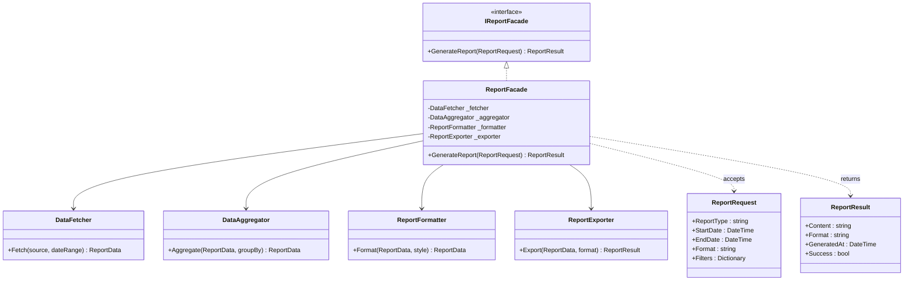
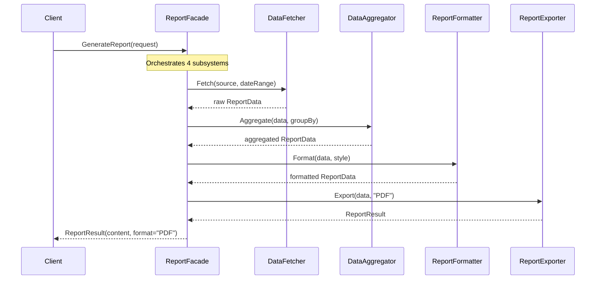

# Facade Pattern

## Memory Hook
"One button does it all" -- provide a single simplified interface to a complex subsystem of classes.

## Problem
Generating a report requires coordinating four subsystems: `DataFetcher` retrieves raw data from databases and APIs, `DataAggregator` computes summaries and groupings, `ReportFormatter` styles the data into tables and charts, and `ReportExporter` renders the final output as PDF, HTML, or CSV. Client code that interacts with these subsystems directly must understand their APIs, manage their dependencies, and call them in the correct order. This couples every client to the internal structure of the reporting subsystem and makes changes to any subsystem ripple out to all clients.

## Naive Approach
Each client (controller, background job, CLI tool) manually instantiates `DataFetcher`, calls `Fetch()`, passes the result to `DataAggregator.Aggregate()`, feeds that into `ReportFormatter.Format()`, and finally calls `ReportExporter.Export()`. Every client duplicates this orchestration logic. When `DataAggregator`'s API changes, every client must be updated. Testing the report generation flow requires setting up all four subsystems.

## Pattern Solution
Create an `IReportFacade` with a single `GenerateReport(ReportRequest request)` method. The `ReportFacade` implementation encapsulates the orchestration: it calls the `DataFetcher`, pipes data through the `DataAggregator`, formats with the `ReportFormatter`, and exports via the `ReportExporter`. Clients interact only with the facade. Internal subsystems can change, be replaced, or be reorganized without affecting client code.

## When To Use
- A subsystem has a complex API with multiple classes that must be used together in a specific order.
- Multiple clients duplicate the same orchestration logic for interacting with the subsystem.
- You want to provide a simple entry point for the most common use cases while still allowing advanced clients to access subsystems directly.
- You need to decouple client code from the internal structure of a subsystem.
- You are integrating a third-party library and want to hide its complexity behind a domain-specific interface.

## When NOT To Use
- The subsystem is already simple and adding a facade creates an unnecessary layer of indirection.
- Every client needs a different customization of the subsystem interaction (the facade becomes a leaky abstraction).
- The facade grows into a "god class" that tries to expose every subsystem feature.
- You are hiding essential complexity that clients genuinely need to understand and control.
- The subsystems are independently useful and clients frequently need to use them in different combinations.

## Key Participants

| Participant | Role |
|---|---|
| `IReportFacade` (Facade Interface) | Declares the simplified `GenerateReport(ReportRequest)` method. |
| `ReportFacade` (Concrete Facade) | Coordinates `DataFetcher`, `DataAggregator`, `ReportFormatter`, and `ReportExporter`. |
| `DataFetcher` (Subsystem) | Retrieves raw data from databases, APIs, or files. |
| `DataAggregator` (Subsystem) | Groups, summarizes, and computes aggregates on raw data. |
| `ReportFormatter` (Subsystem) | Formats aggregated data into a presentable structure (tables, charts). |
| `ReportExporter` (Subsystem) | Renders the formatted report into the requested output format (PDF, HTML, CSV). |
| `ReportRequest` (Input DTO) | Carries report parameters: type, date range, format, filters. |
| `ReportResult` (Output DTO) | Carries the generated report: content, format, metadata. |
| `ReportData` (Internal DTO) | Intermediate data model passed between subsystems. |

## Variants
- **Static Facade:** A static class with static methods. Simple but not testable or mockable.
- **Abstract Facade (this repo):** An interface (`IReportFacade`) allows different facade implementations and is easy to mock in tests.
- **Facade with Default Configuration:** The facade provides sensible defaults but accepts optional parameters for customization.
- **Facade as Anti-Corruption Layer:** In DDD, a facade can translate between a bounded context's internal model and an external system's model.

## Tradeoffs

| Advantage | Disadvantage |
|---|---|
| Simplifies the API for the most common use cases. | Can become a god class if it tries to expose everything. |
| Decouples clients from subsystem internals. | Adds an extra layer of indirection. |
| Subsystems can be refactored without affecting clients. | May restrict access to advanced subsystem features. |
| Single place for orchestration logic (DRY). | If overused, facades hide necessary complexity from developers. |
| Easy to test client code that depends on the facade interface. | Facade must be updated when new subsystem capabilities are added. |

## Common Interview Questions
1. How does the Facade pattern differ from the Adapter pattern?
2. When does a Facade become a "god class," and how do you prevent it?
3. Can a Facade and a Mediator solve similar problems, and how do they differ?

## Comparison with Similar Patterns

| Aspect | Facade | Adapter |
|---|---|---|
| Intent | Simplify a complex subsystem's interface. | Convert one interface to another that clients expect. |
| Scope | Wraps multiple subsystem classes. | Wraps a single class or interface. |
| Direction | Creates a new, simpler interface. | Makes an existing interface compatible with a required interface. |
| Client knowledge | Client does not need to know the subsystem. | Client knows the target interface. |
| Typical use | Orchestrating report generation, payment processing. | Integrating a third-party library with an incompatible API. |

## Mermaid Class Diagram

## Mermaid Sequence Diagram

## Similar Patterns to Review Next
- **Adapter** -- converts interfaces for compatibility; Facade simplifies interfaces for convenience.
- **Mediator** -- centralizes communication between objects; Facade centralizes access to a subsystem.
- **Abstract Factory** -- can use a Facade to simplify the creation of related objects.
- **Builder** -- step-by-step construction can be hidden behind a Facade for common configurations.
