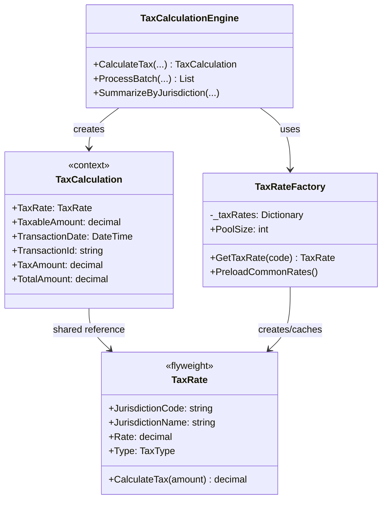
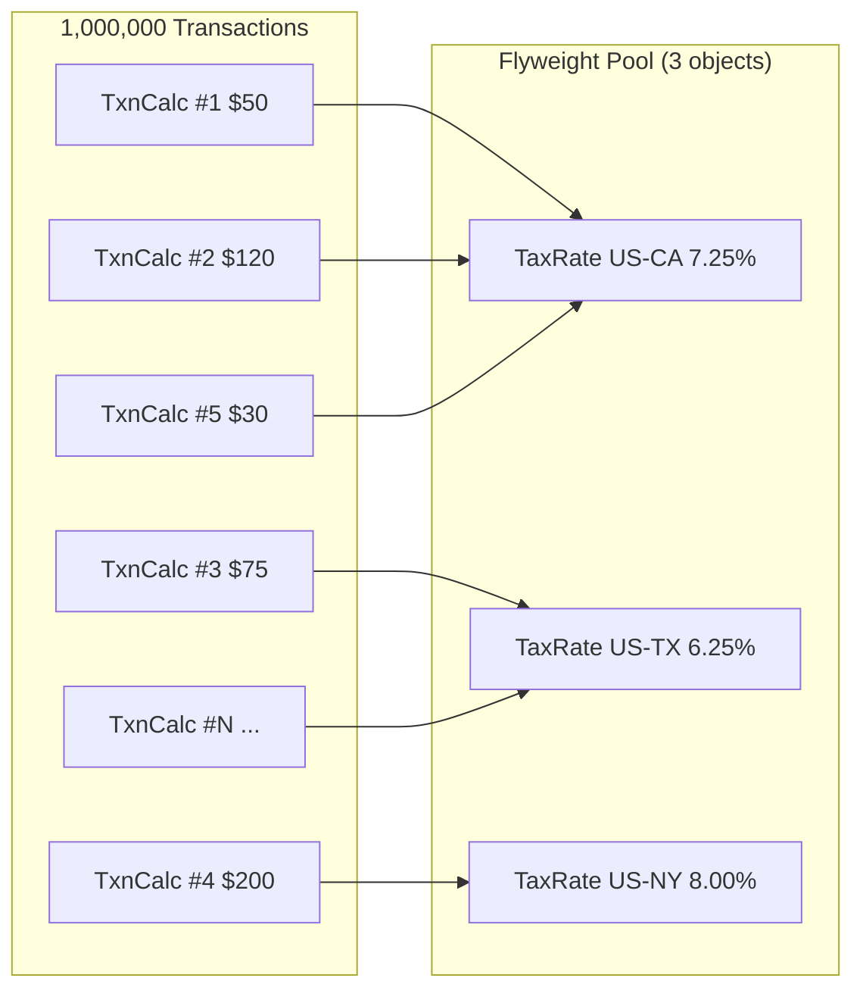

# Flyweight Pattern

## Memory Hook (one-liner)
**"Share the constant, carry the unique"** — millions of tax calculations share a handful of tax rate objects because the rate is the same for every transaction in a jurisdiction.

## Problem
Your tax calculation engine processes millions of transactions daily. Each transaction needs a `TaxRate` object with jurisdiction code, name, rate percentage, and type. But there are only ~50 unique jurisdictions. Without sharing:
- 1,000,000 transactions x ~80 bytes per TaxRate = **~80 MB** of duplicated objects
- GC pressure from millions of identical short-lived objects

With flyweight:
- ~50 unique TaxRate objects x ~80 bytes = **~4 KB** total

## Naive Approach
```csharp
// Every transaction creates its own TaxRate — massive duplication
foreach (var transaction in millionTransactions)
{
    var taxRate = new TaxRate  // New object every time!
    {
        JurisdictionCode = "US-CA",
        Rate = 0.0725m,
        // ... same data, repeated 200,000 times for California alone
    };
    var tax = taxRate.CalculateTax(transaction.Amount);
}
```

## Pattern Solution
Separate state into:
- **Intrinsic state** (shared, immutable): Tax rate, jurisdiction name, type — stored in the flyweight
- **Extrinsic state** (unique per context): Transaction amount, date, ID — passed in from outside

A `TaxRateFactory` maintains a pool of shared TaxRate flyweights. Multiple TaxCalculation contexts reference the same TaxRate instance.

## When To Use
- An application uses a large number of objects that share significant common state
- Most object state can be made extrinsic (stored outside the object)
- Many groups of objects can be replaced by a few shared objects
- The application doesn't depend on object identity (shared objects are interchangeable)
- Memory savings outweigh the complexity of separating intrinsic/extrinsic state

## When NOT To Use
- Objects don't share significant state — each is unique
- The number of objects is small (hundreds, not millions)
- Intrinsic and extrinsic state can't be clearly separated
- Object identity matters (each object must be a distinct instance)
- The shared state is mutable (breaks thread safety of shared objects)

## Participants
| Participant | Role | In Our Example |
|---|---|---|
| **Flyweight** | Shared object storing intrinsic state | `TaxRate` (rate, jurisdiction, type) |
| **Flyweight Factory** | Creates and manages shared instances | `TaxRateFactory` |
| **Context** | Stores extrinsic state, references flyweight | `TaxCalculation` (amount, date, txn ID) |
| **Client** | Uses flyweights through the factory | `TaxCalculationEngine` |

## Variants
- **Simple Flyweight**: Single shared type (our example).
- **Unshared Flyweight**: Some instances are not shared (e.g., custom tax rates for special zones).
- **Composite Flyweight**: Flyweight that contains other flyweights (e.g., multi-tier tax rates).

## Tradeoffs Table
| Aspect | Advantage | Disadvantage |
|---|---|---|
| **Memory** | Dramatic reduction when sharing is high | Negligible savings if objects are already small |
| **Performance** | Less GC pressure, better cache locality | Factory lookup adds small overhead |
| **Thread Safety** | Immutable flyweights are inherently safe | Mutable extrinsic state needs synchronization |
| **Complexity** | Simple concept once intrinsic/extrinsic split is clear | Must carefully separate state categories |
| **Debugging** | Fewer unique objects to inspect | Shared references can be confusing during debugging |

## Common Interview Questions
1. **What makes a good flyweight candidate?** Large number of instances, significant shared immutable state, identity doesn't matter.
2. **String interning — is that Flyweight?** Yes! `string.Intern()` is the CLR's built-in flyweight for strings.
3. **Flyweight vs Object Pool?** Flyweight shares immutable objects read concurrently; Object Pool recycles mutable objects used sequentially.
4. **Flyweight vs Singleton?** Singleton: one instance globally. Flyweight: one instance per unique key (many flyweights, each shared).
5. **Flyweight in .NET?** `string` interning, `Enum` boxing cache, `ImmutableArray<T>.Empty`, font/brush caching in WPF/WinForms.

## Comparison with Similar Patterns
| Pattern | Purpose | Key Difference |
|---|---|---|
| **Flyweight** | Share objects to save memory | Multiple shared instances keyed by state |
| **Singleton** | Ensure one instance globally | One instance total, not per key |
| **Object Pool** | Reuse expensive objects | Mutable objects, sequential reuse |
| **Prototype** | Clone objects efficiently | Creates copies, Flyweight shares originals |
| **Factory Method** | Create objects | Flyweight Factory is a specialized factory |

## Mermaid Diagrams

### Class Diagram


### Memory Sharing Diagram


## Similar Patterns to Review Next
- **Singleton** — Special case of Flyweight with exactly one shared instance
- **Object Pool** — Reuse pattern for mutable, expensive-to-create objects
- **Factory Method** — The flyweight factory is a specialized factory
- **Prototype** — Cloning vs sharing: Prototype copies, Flyweight shares
