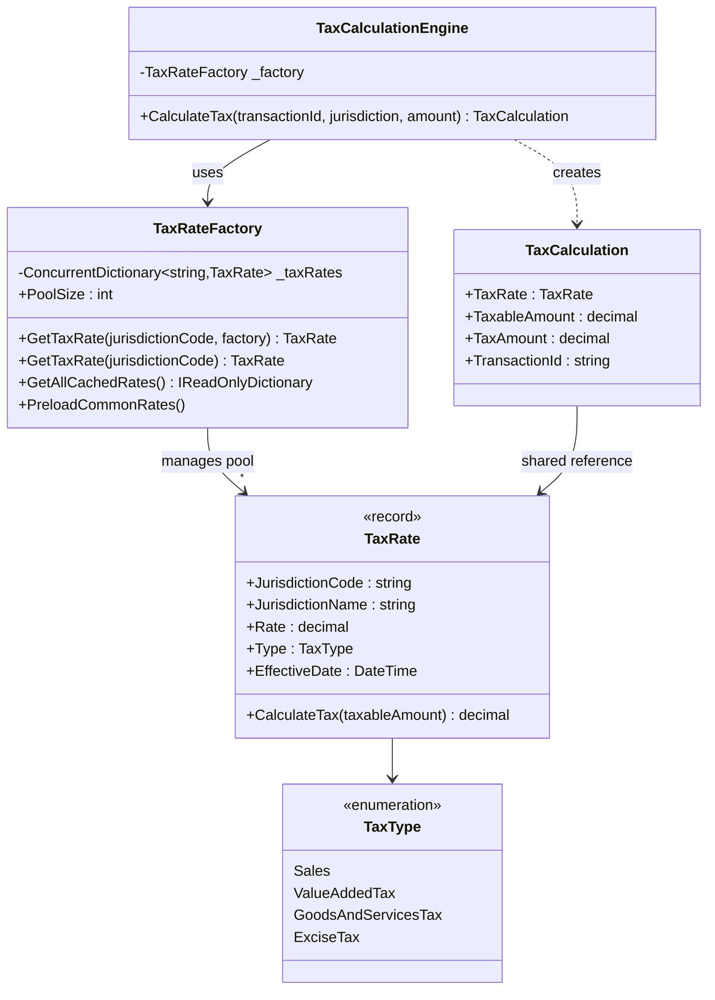
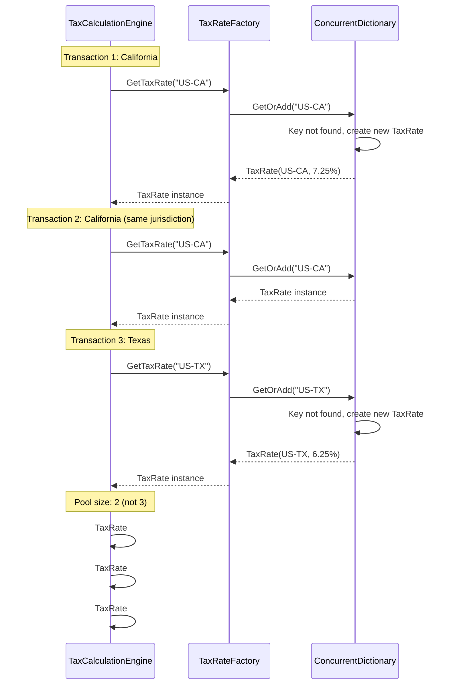

# Flyweight Pattern

## Memory Hook
"Share what's the same, keep what's different separate" -- minimize memory by sharing immutable intrinsic state across many objects.

## Problem
A tax calculation engine processes millions of transactions per day. Each transaction needs a `TaxRate` object containing the jurisdiction code, jurisdiction name, rate percentage, tax type, and effective date. Without sharing, processing 1 million California transactions creates 1 million identical `TaxRate` objects (~80 bytes each = ~80 MB of duplicated data). The system's memory footprint grows linearly with transaction volume even though there are only ~50 unique tax jurisdictions.

## Naive Approach
Each `TaxCalculation` creates its own `TaxRate` instance: `new TaxRate { JurisdictionCode = "US-CA", Rate = 0.0725m, ... }`. With 1 million transactions across 50 jurisdictions, you get 1 million `TaxRate` objects instead of 50. Memory usage is dominated by duplicated immutable data. GC pressure increases as these short-lived objects are allocated and collected.

## Pattern Solution
Separate the **intrinsic state** (shared, immutable: jurisdiction code, name, rate, type, effective date) from the **extrinsic state** (per-transaction: taxable amount). The `TaxRate` record is the flyweight -- immutable and shared. The `TaxRateFactory` manages a pool of flyweight instances using a `ConcurrentDictionary`, returning the same `TaxRate` instance for all transactions in the same jurisdiction. The `TaxCalculation` holds a reference to the shared `TaxRate` and stores the per-transaction `TaxableAmount` locally. Result: 50 `TaxRate` objects (~4 KB) instead of 1 million (~80 MB).

## When To Use
- The application creates a very large number of objects that share significant common state.
- The shared state is immutable and can be safely reused across objects.
- Memory usage is a bottleneck and reducing object count would meaningfully help.
- The extrinsic (per-instance) state is small or can be computed on the fly.
- Object identity does not matter (interchangeable instances are acceptable).

## When NOT To Use
- The number of objects is small and memory is not a concern.
- Each object has mostly unique state with little sharing opportunity.
- The shared state is mutable, making sharing unsafe without synchronization.
- The complexity of separating intrinsic from extrinsic state outweighs the memory savings.
- You are prematurely optimizing before profiling confirms memory as a bottleneck.

## Key Participants

| Participant | Role |
|---|---|
| `TaxRate` (Flyweight) | Immutable record with intrinsic state: jurisdiction code/name, rate, tax type, effective date. Contains `CalculateTax(taxableAmount)` that uses extrinsic state. |
| `TaxRateFactory` (Flyweight Factory) | Manages the pool of shared `TaxRate` instances in a `ConcurrentDictionary`. Returns existing instances or creates new ones. |
| `TaxCalculation` (Context) | Holds a reference to a shared `TaxRate` flyweight plus extrinsic state (taxable amount, transaction ID). |
| `TaxCalculationEngine` | Processes transactions by obtaining shared `TaxRate` from the factory and creating `TaxCalculation` contexts. |
| `TaxType` (Enum) | Categorizes tax types: Sales, VAT, GST, ExciseTax. |

## Variants
- **Immutable Record Flyweight (this repo):** C# `record` provides value equality and immutability, making it naturally suited for flyweights.
- **String Interning:** .NET's `string.Intern()` is a built-in flyweight for string values. The CLR maintains a pool of interned strings.
- **Glyph Flyweight:** Classic example from the GoF book: character glyphs in a text editor share font/style (intrinsic) while position (extrinsic) differs.
- **Enum-Based Flyweight:** When the set of flyweights is fixed and known at compile time, an enum with associated data serves as a lightweight flyweight.

## Tradeoffs

| Advantage | Disadvantage |
|---|---|
| Dramatic memory reduction when sharing is high (80 MB to 4 KB in this example). | Increases code complexity by separating intrinsic and extrinsic state. |
| Thread-safe sharing with immutable flyweight instances. | Factory lookup adds a small runtime overhead per access. |
| Reduced GC pressure from fewer object allocations. | Flyweight objects cannot carry per-instance mutable state. |
| `ConcurrentDictionary` enables safe concurrent access. | Debugging is harder when multiple objects share the same flyweight reference. |
| `PreloadCommonRates()` avoids lazy creation overhead under load. | Memory savings are only significant at large scale; negligible for small datasets. |

## Common Interview Questions
1. How does the Flyweight pattern differ from a simple cache, and when would you use each?
2. What is the difference between intrinsic and extrinsic state, and how do you decide what goes where?
3. How does `string.Intern()` in .NET relate to the Flyweight pattern?

## Comparison with Similar Patterns

| Aspect | Flyweight | Caching |
|---|---|---|
| Purpose | Reduce memory by sharing immutable objects. | Reduce latency by storing computed results. |
| What is shared | Intrinsic object state (e.g., tax rate data). | Computed results (e.g., API responses, query results). |
| Mutability | Flyweight objects must be immutable. | Cached values can be mutable (with invalidation). |
| Lifetime | Flyweight lives as long as the factory exists. | Cache entries have TTL and eviction policies. |
| Granularity | Fine-grained (individual objects). | Coarse-grained (complete operation results). |
| When to use | Millions of similar objects with shared state. | Expensive computations or I/O that should not be repeated. |

## Mermaid Class Diagram

## Mermaid Sequence Diagram

## Similar Patterns to Review Next
- **Singleton** -- ensures only one instance of a class; Flyweight ensures only one instance per shared key.
- **Prototype** -- clones objects to avoid expensive creation; Flyweight shares objects to avoid creation entirely.
- **Object Pool** -- reuses mutable objects; Flyweight shares immutable objects.
- **Factory Method** -- the `TaxRateFactory` uses a factory-style creation for managing the flyweight pool.
