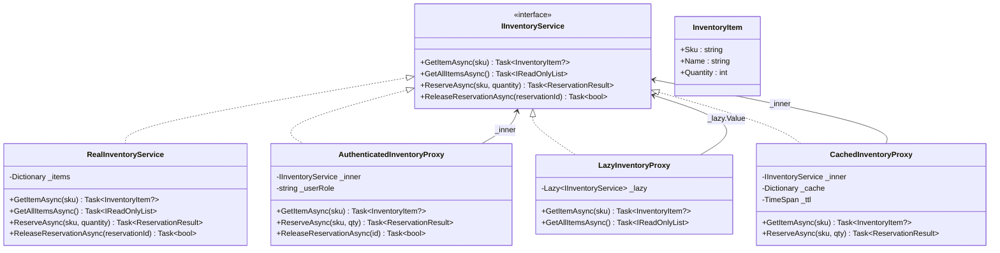
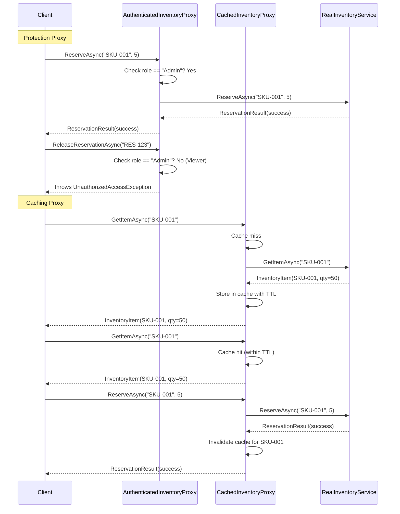

# Proxy Pattern

## Memory Hook
"A stand-in that controls access" -- a surrogate object that intercepts calls to the real object to add access control, lazy loading, or caching.

## Problem
An inventory service manages stock levels, reservations, and releases. Different contexts need different behaviors wrapped around the same service: administrators need full access while warehouse staff should be restricted from releasing reservations; expensive data loads should be deferred until actually needed; and frequently queried inventory levels should be cached to avoid repeated database calls. Without proxies, these cross-cutting access-control, lazy-loading, and caching concerns pollute the core inventory logic.

## Naive Approach
The `RealInventoryService` class accumulates `if (user.Role != "Admin") throw ...` checks, lazy-loading flags, and caching dictionaries directly in its methods. Each method grows with concerns unrelated to inventory management. Testing the pure inventory logic requires navigating around authorization checks and cache states. Adding a new access pattern (e.g., rate-limiting) means modifying the already-complex service class.

## Pattern Solution
Define an `IInventoryService` interface with `GetItemAsync`, `GetAllItemsAsync`, `ReserveAsync`, and `ReleaseReservationAsync`. The `RealInventoryService` contains only the core inventory logic. Three proxy types wrap it:

- **`AuthenticatedInventoryProxy` (Protection Proxy):** Checks user roles before delegating to the real service. Unauthorized calls throw `UnauthorizedAccessException`.
- **`LazyInventoryProxy` (Virtual Proxy):** Defers creation of the expensive `RealInventoryService` until the first method call, using `Lazy<T>`.
- **`CachedInventoryProxy` (Caching Proxy):** Caches `GetItemAsync` and `GetAllItemsAsync` results with TTL; write operations invalidate the cache.

Each proxy implements `IInventoryService` and is transparent to clients.

## When To Use
- You need to control access to an object (protection proxy for authorization).
- You want to defer expensive initialization until the object is actually used (virtual/lazy proxy).
- You want to cache results of expensive operations transparently (caching proxy).
- The real object is remote, and the proxy handles network communication (remote proxy).
- You want to add logging, metering, or validation without modifying the real service.

## When NOT To Use
- There is only one simple behavior to add, and a Decorator is a better fit.
- The proxy logic is complex enough to warrant a full middleware pipeline instead.
- The real object is cheap to create and access, and adding a proxy just adds unnecessary indirection.
- You need to compose multiple behaviors (Decorator pattern is more natural for composition).
- The proxy needs to modify the return type or the interface, which breaks the transparent substitution.

## Key Participants

| Participant | Role |
|---|---|
| `IInventoryService` (Subject Interface) | Declares `GetItemAsync`, `GetAllItemsAsync`, `ReserveAsync`, `ReleaseReservationAsync`. |
| `RealInventoryService` (Real Subject) | Core inventory logic: in-memory stock management with reservations. |
| `AuthenticatedInventoryProxy` (Protection Proxy) | Verifies user role before delegating. Blocks unauthorized operations. |
| `LazyInventoryProxy` (Virtual Proxy) | Uses `Lazy<IInventoryService>` to defer creation of the real service until first use. |
| `CachedInventoryProxy` (Caching Proxy) | Caches read results; invalidates cache on write operations. |
| `InventoryItem` | Domain model with SKU, name, quantity, and reservation tracking. |
| `ReservationResult` | Result DTO for reservation operations. |

## Variants
- **Remote Proxy:** Represents an object in a different address space (WCF, gRPC client stubs).
- **Smart Reference Proxy:** Adds reference counting or access logging on top of the real object.
- **Copy-on-Write Proxy:** Defers copying a shared resource until a mutation is requested.
- **Firewall Proxy:** Protects the real subject from unauthorized network access (API gateway pattern).

## Tradeoffs

| Advantage | Disadvantage |
|---|---|
| Transparent: clients use the same interface as the real service. | Adds a layer of indirection that can complicate debugging. |
| Separation of concerns: access control, caching, and lazy loading are isolated from business logic. | Each proxy must implement the full interface, even for pass-through methods. |
| Can be introduced without changing existing client code. | Stacking multiple proxies (protection + caching + lazy) creates deep call chains. |
| Virtual proxy improves startup time by deferring expensive initialization. | Caching proxy must handle cache invalidation correctly, which is notoriously hard. |
| Protection proxy centralizes authorization logic. | Proxy and real object must stay in sync when the interface changes. |

## Common Interview Questions
1. How does the Proxy pattern differ from the Decorator pattern, and when would you choose one over the other?
2. What are the three main types of proxies (protection, virtual, caching), and when do you use each?
3. How would you implement a caching proxy with proper cache invalidation in a multi-threaded environment?

## Comparison with Similar Patterns

| Aspect | Proxy | Decorator |
|---|---|---|
| Intent | Control access to the real object. | Add new behavior to the object. |
| Relationship to real object | Proxy often controls the lifecycle of the real object. | Decorator does not control the lifecycle; it wraps whatever is given. |
| Transparency | Client is unaware a proxy exists. | Client is unaware decorators exist. |
| Typical count | One proxy per concern (protection, caching, lazy). | Multiple decorators stacked in a chain. |
| Focus | Access: who, when, and how the real object is accessed. | Enhancement: what additional behavior surrounds the operation. |
| Creation | Proxy may create the real object internally (virtual proxy). | Decorator always receives the object to wrap from outside. |

## Mermaid Class Diagram

## Mermaid Sequence Diagram

## Similar Patterns to Review Next
- **Decorator** -- adds new behavior by wrapping; Proxy controls access by wrapping.
- **Adapter** -- converts one interface to another; Proxy keeps the same interface.
- **Facade** -- simplifies a complex subsystem; Proxy wraps a single object.
- **Flyweight** -- shares object instances to save memory; a proxy might defer creation of a flyweight factory.
