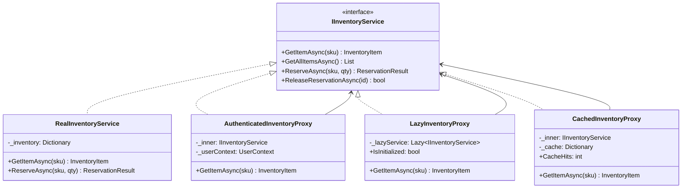
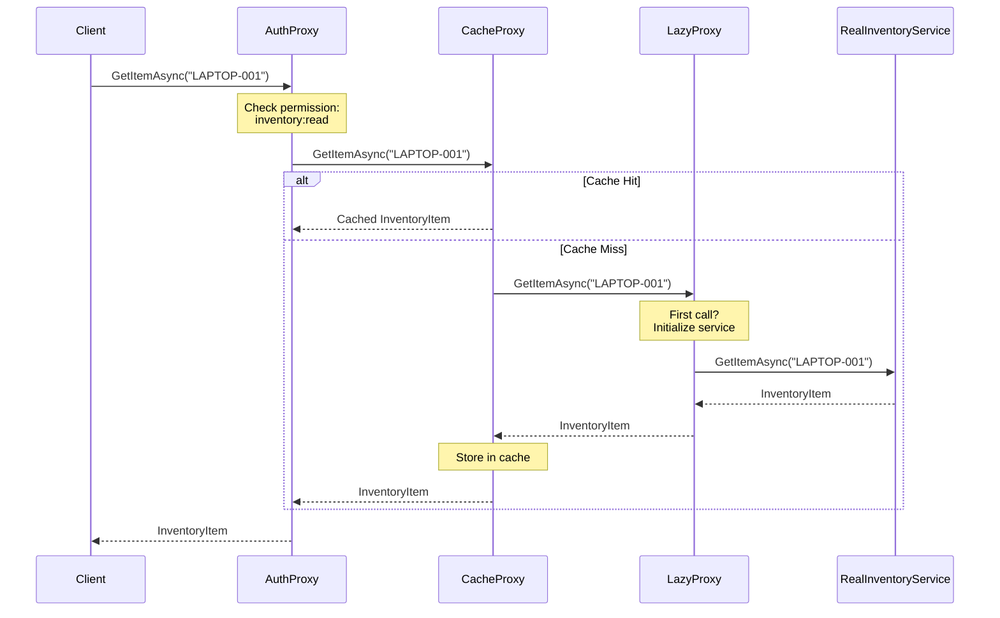

# Proxy Pattern

## Memory Hook (one-liner)
**"The bouncer, the lazy loader, and the cache — all wearing the same uniform"** — a stand-in that controls access to the real object while looking identical to it.

## Problem
Your inventory reservation service is expensive to initialize, handles sensitive data, and gets called repeatedly with the same queries. You need:
- **Authentication checks** before any operation (Protection Proxy)
- **Deferred initialization** to avoid startup cost until first use (Virtual Proxy)
- **Response caching** to avoid redundant database queries (Caching Proxy)

Without proxies, these concerns would be mixed into the service itself, violating Single Responsibility.

## Naive Approach
```csharp
class InventoryService
{
    public async Task<Item> GetItem(string sku, UserContext user)
    {
        // Auth check — doesn't belong here
        if (!user.HasPermission("inventory:read"))
            throw new UnauthorizedAccessException();

        // Cache check — doesn't belong here
        if (_cache.TryGetValue(sku, out var cached))
            return cached;

        // Lazy init — doesn't belong here
        if (_db == null) _db = await ConnectToDatabase();

        // Actual business logic buried under cross-cutting concerns
        return await _db.QueryAsync(sku);
    }
}
```

## Pattern Solution
Create separate proxy classes that each implement `IInventoryService`:
- `AuthenticatedInventoryProxy` — checks permissions before delegating
- `LazyInventoryProxy` — defers service creation until first call
- `CachedInventoryProxy` — caches read results, invalidates on writes

Each proxy wraps the same interface, adding one specific concern. They can be composed: `Auth(Cached(Lazy(RealService)))`.

## When To Use
- **Protection Proxy**: When access control must be enforced transparently
- **Virtual Proxy**: When the real object is expensive to create and may not be needed
- **Caching Proxy**: When repeated calls return the same data and the source is slow
- **Remote Proxy**: When the real object exists in a different address space (WCF, gRPC)
- **Logging/Monitoring Proxy**: When you need to track usage without modifying the real service

## When NOT To Use
- The real object is cheap to create and access doesn't need control
- Adding a proxy would introduce unacceptable latency for high-frequency calls
- The interface has too many methods (proxy becomes tedious to maintain)
- When Decorator is more appropriate (adding behavior vs controlling access)
- When AOP (Aspect-Oriented Programming) frameworks handle cross-cutting concerns better

## Participants
| Participant | Role | In Our Example |
|---|---|---|
| **Subject** | Common interface for Real and Proxy | `IInventoryService` |
| **Real Subject** | The actual service with business logic | `RealInventoryService` |
| **Proxy** | Controls access to Real Subject | `AuthenticatedInventoryProxy`, `LazyInventoryProxy`, `CachedInventoryProxy` |
| **Client** | Works with Subject interface | Application services |

## Variants
- **Protection Proxy**: Access control (authentication, authorization). Our `AuthenticatedInventoryProxy`.
- **Virtual Proxy**: Lazy initialization. Our `LazyInventoryProxy`.
- **Caching Proxy**: Stores results of expensive operations. Our `CachedInventoryProxy`.
- **Remote Proxy**: Represents an object in another process/machine (WCF proxy, gRPC client).
- **Smart Reference Proxy**: Adds reference counting, locking, or logging.

## Tradeoffs Table
| Aspect | Advantage | Disadvantage |
|---|---|---|
| **Separation of Concerns** | Each proxy handles one cross-cutting concern | Multiple proxy classes for multiple concerns |
| **Transparency** | Client code doesn't know it's using a proxy | Debugging through proxy layers can be confusing |
| **Composability** | Stack multiple proxies (auth + cache + lazy) | Order of composition matters |
| **Performance** | Caching proxy improves performance dramatically | Each proxy layer adds slight overhead |
| **Security** | Protection proxy centralizes auth checks | Must ensure proxy can't be bypassed |

## Common Interview Questions
1. **Proxy vs Decorator?** Proxy controls access to an object; Decorator adds behavior. Proxy often creates/manages the wrapped object; Decorator receives it externally.
2. **Proxy in .NET?** `Lazy<T>` (virtual proxy), Entity Framework change tracking proxies, WCF service proxies, `DispatchProxy` for AOP.
3. **Can proxies be composed?** Yes — `AuthProxy(CacheProxy(LazyProxy(RealService)))`. Order matters.
4. **What's the difference between Caching Proxy and Decorator with caching?** Semantically the same pattern. "Proxy" emphasizes controlling access; "Decorator" emphasizes adding behavior.
5. **How does Protection Proxy relate to ASP.NET authorization?** `[Authorize]` attributes and middleware act as protection proxies for controller actions.

## Comparison with Similar Patterns
| Pattern | Purpose | Key Difference |
|---|---|---|
| **Proxy** | Control access to an object | Same interface, controlled access |
| **Decorator** | Add behavior to an object | Same interface, enhanced behavior |
| **Adapter** | Change an object's interface | Different interface |
| **Facade** | Simplify a subsystem | Different (simpler) interface |
| **Flyweight** | Share objects for memory savings | Proxy adds indirection, Flyweight reduces it |

## Mermaid Diagrams

### Class Diagram


### Proxy Chain Sequence


## Similar Patterns to Review Next
- **Decorator** — Very similar structure; the line between "controlling access" and "adding behavior" is often blurry
- **Adapter** — Also wraps an object, but to change the interface rather than control access
- **Facade** — Simplifies an entire subsystem; Proxy wraps a single object
- **Flyweight** — Both manage object access, but Flyweight reduces instances while Proxy adds indirection
